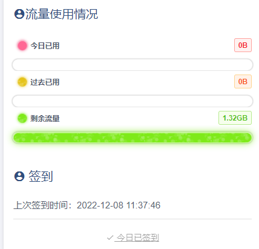
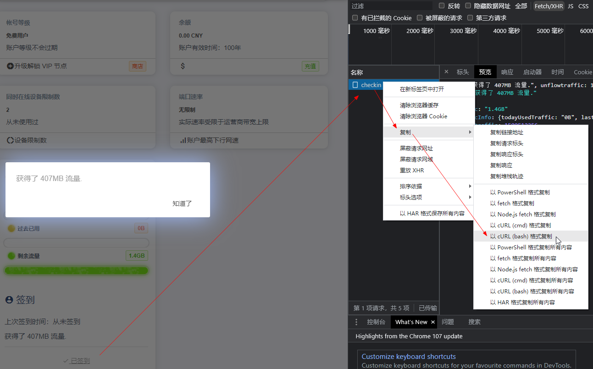

# 签到

f12 -> 签到 -> 请求 -> 右击复制 -> 以cURL(bash)格式复制

然后可以去linux服务器上自己搞个定时任务去执行每日签到获取免费流量





---

ex:

```shell
# 脚本
cat> /home/shell/v2free-sign-in.sh <<EOF
curl 'https://go.runba.cyou/user/checkin' \
  -X 'POST' \
  -H 'Accept: application/json, text/javascript, */*; q=0.01' \
  -H 'Accept-Language: zh-CN,zh;q=0.9' \
  -H 'Connection: keep-alive' \
  -H 'Content-Length: 0' \
  -H 'Cookie: _ga=GA1.1.1426539022.1670471104; _gcl_au=1.1.1878334283.1670984640; uid=97303; email=zq1%40uuf.me; key=c627b3b79ee38488cbc472344dfe93f35e5411b243434; ip=4b5dabe0ec85fce7c69c08d745f5148b; expire_in=1673576875; _ga_NC10VPE6SR=GS1.1.1670984630.2.1.1670984886.0.0.0' \
  -H 'Origin: https://go.runba.cyou' \
  -H 'Referer: https://go.runba.cyou/user' \
  -H 'Sec-Fetch-Dest: empty' \
  -H 'Sec-Fetch-Mode: cors' \
  -H 'Sec-Fetch-Site: same-origin' \
  -H 'User-Agent: Mozilla/5.0 (Windows NT 10.0; WOW64) AppleWebKit/537.36 (KHTML, like Gecko) Chrome/107.0.0.0 Safari/537.36' \
  -H 'X-Requested-With: XMLHttpRequest' \
  -H 'sec-ch-ua: "Google Chrome";v="107", "Chromium";v="107", "Not=A?Brand";v="24"' \
  -H 'sec-ch-ua-mobile: ?0' \
  -H 'sec-ch-ua-platform: "Windows"' \
  --compressed

curl 'https://ikuuu.me/user' \
  -X 'POST' \
  -H 'Accept: text/html,application/xhtml+xml,application/xml;q=0.9,image/avif,image/webp,image/apng,*/*;q=0.8,application/signed-exchange;v=b3;q=0.7' \
  -H 'Accept-Language: zh-CN,zh;q=0.9' \
  -H 'Connection: keep-alive' \
  -H 'Content-Length: 0' \
  -H 'Cookie: lang=zh-cn; uid=1756319; email=3407691546%40qq.com; _gid=GA1.2.631930817.1702797151; key=00e61a7e7689d22a7778cb644c36d3d65afafe7c0c431; ip=2e7555bc5ccefad66cf845486a06df76; expire_in=1703401996; _ga_8HVN7928SC=GS1.1.1702797145.1.1.1702799687.0.0.0; _ga=GA1.1.904219164.1702797145' \
  -H 'Referer: https://ikuuu.me/user/node' \
  -H 'Sec-Fetch-Dest: empty' \
  -H 'Sec-Fetch-Mode: navigate' \
  -H 'Sec-Fetch-Site: same-origin' \
  -H 'User-Agent: Mozilla/5.0 (Windows NT 10.0; Win64; x64) AppleWebKit/537.36 (KHTML, like Gecko) Chrome/120.0.0.0 Safari/537.36' \
  -H 'X-Requested-With: XMLHttpRequest' \
  -H 'sec-ch-ua: "Not_A Brand";v="8", "Chromium";v="120", "Google Chrome";v="120"' \
  -H 'sec-ch-ua-mobile: ?0' \
  -H 'sec-ch-ua-platform: "Windows"' \
  --compressed
EOF


# 追加配置到定时任务配置文件中
cat>> /etc/crontab <<EOF

# v2free定时签到 (每天0点的01分执行1次)
1 0 * * * root sh /home/shell/v2free-sign-in.sh >> /home/shell/v2free-sign-in-log.txt

# ikuuu定时签到 (每天0点的01分执行1次)
1 0 * * * root sh /home/shell/ikuuu-sign-in.sh >> /home/shell/ikuuu-sign-in-log.txt
EOF


# 重新载入配置
service crond reload
```