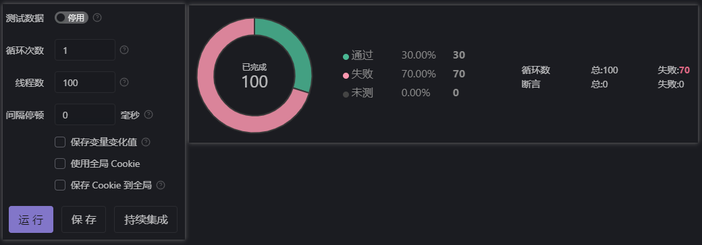

# SpringBoot可以同时处理多少请求

默认配置

```yml
server:
  tomcat:
    threads:
      min-spare: 10 # 最小工作线程数
      max: 200      # 最大线程数
    max-connections: 8192 # 接受和处理的最大连接数，超过8192的请求就会被放入到等待队列中
    accept-count: 100 # 可以放到等待队列中的请求数
```

SpringBoot同所能处理的最大请求数量是`max-connections`+`accept-count`，超过该数量的请求直接就会被丢掉。

修改配置进行测试

```yml
server:
  tomcat:
    threads:
      min-spare: 5
      max: 10
    max-connections: 20
    accept-count: 10
```



---

理解：

开了一个奶茶店，里面有长期工5人，临时工5人，共10人工作，提供了20个座位，店内工作可供10个人排队等待。

- 来了5个客户，由长期工5人负责服务
- 来了20-30个客户，由长期工+临时工共10人负责服务，超过座位数20的人进行排队
- 来了50个客户，由长期工+临时工共10人负责服务，此时店内只能满足20个座位+10个排队的共30个人的服务，其余20个人拒绝服务
