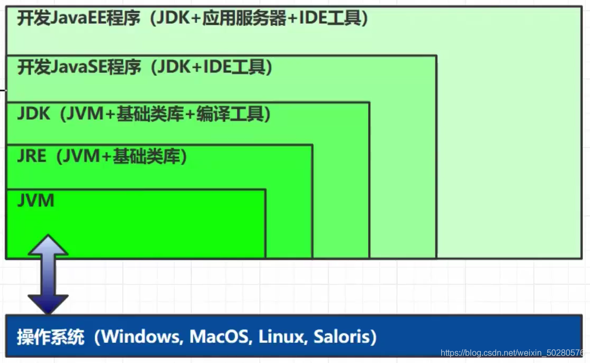
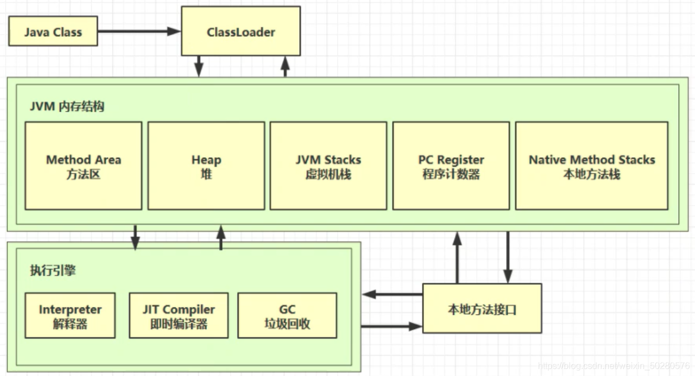
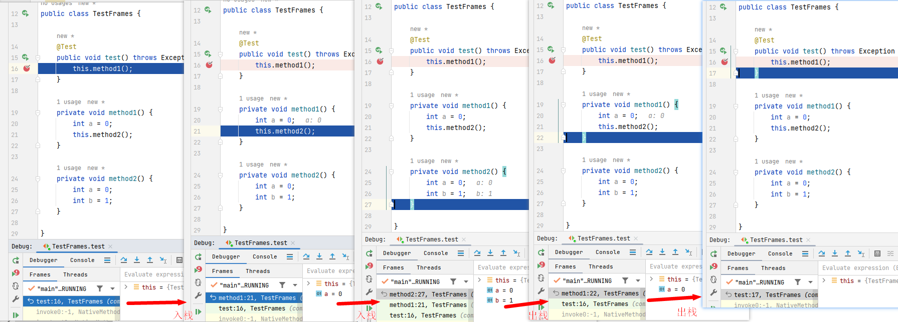
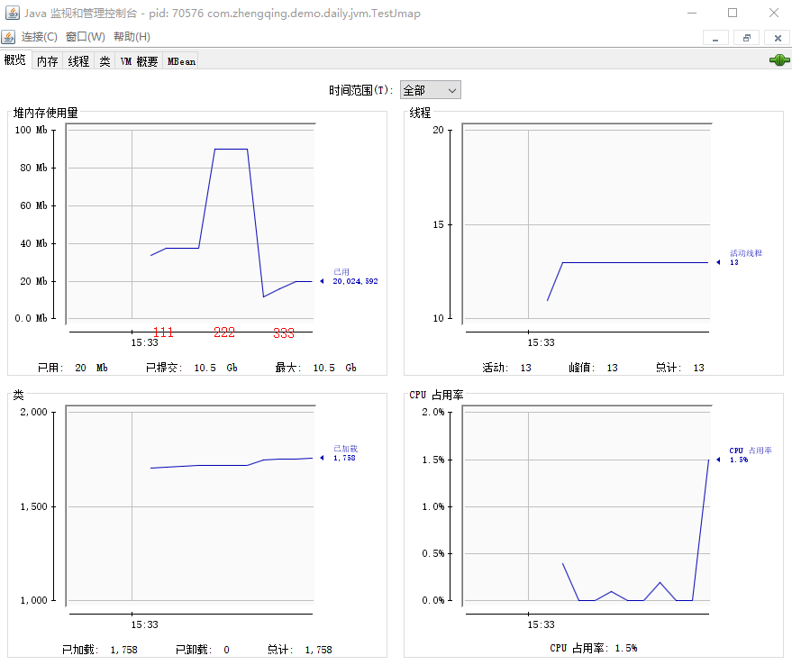
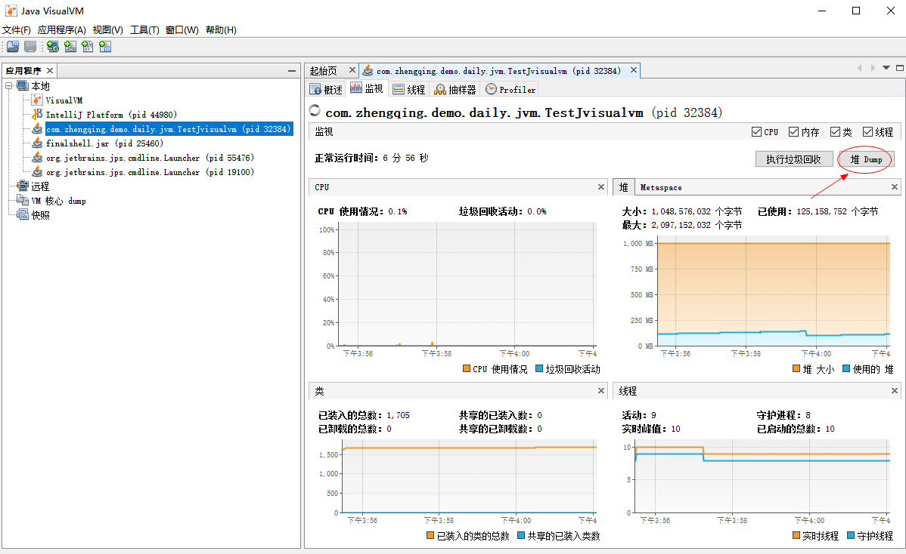
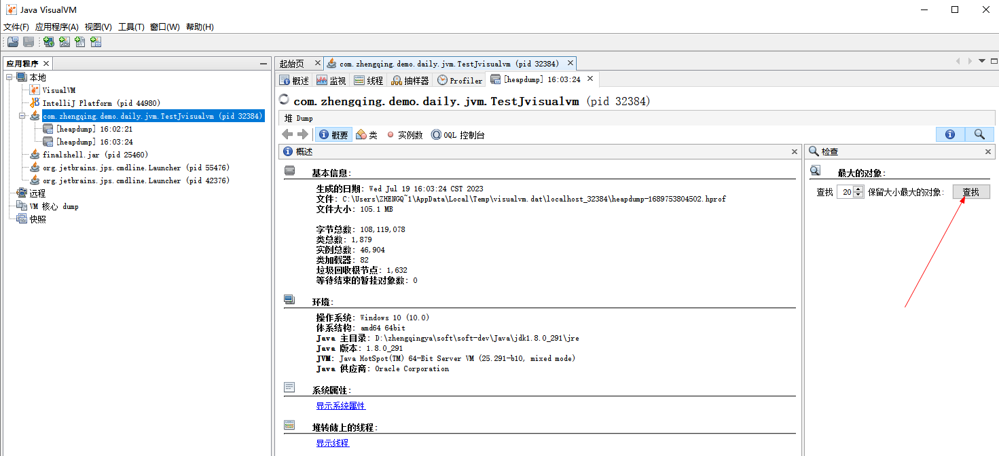
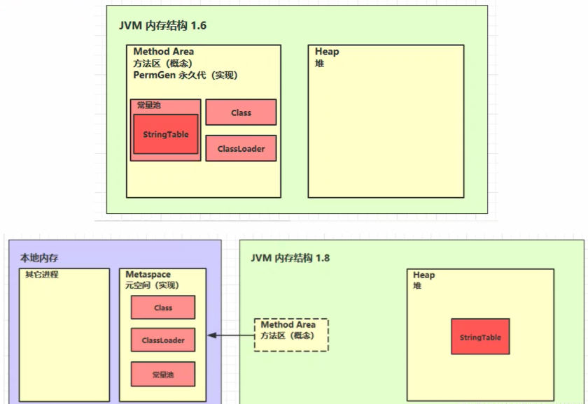

### 一、前言

#### 1、什么是 JVM ？

Java Virtual Machine ，Java 程序的**运行环境**（Java 二进制字节码的运行环境）。

* 一次编译，处处执行
* 自动的内存管理，垃圾回收机制
* 数组下标越界检查

JVM、JRE、JDK 的关系如下图所示  


#### 2、学习 JVM 有什么用？

* 面试必备
* 中高级程序员必备
* 想走的长远，就需要懂原理，比如：自动装箱、自动拆箱是怎么实现的，反射是怎么实现的，垃圾回收机制是怎么回事等待，JVM 是必须掌握的。

#### 3、常见的 JVM


我们主要学习的是 HotSpot 版本的虚拟机。

#### 4、学习路线



ClassLoader：Java 代码编译成二进制后，会经过类加载器，这样才能加载到 JVM 中运行。  
Method Area：类是放在方法区中。  
Heap：类的实例对象。  
当类调用方法时，会用到 JVM Stack、PC Register、本地方法栈。  
方法执行时的每行代码是有执行引擎中的解释器逐行执行，方法中的热点代码频繁调用的方法，由 JIT 编译器优化后执行，GC
会对堆中不用的对象进行回收。需要和操作系统打交道就需要使用到本地方法接口。

### 二、内存结构

#### 1、程序计数器

##### 1）定义

Program Counter Register 程序计数器（寄存器）  
作用：是记录下一条 jvm 指令的执行地址行号。

特点：

* 是线程私有的
* 不会存在内存溢出

##### 2）作用

```
0: getstatic #20 // PrintStream out = System.out; 
3: astore_1 // -- 
4: aload_1 // out.println(1); 
5: iconst_1 // -- 
6: invokevirtual #26 // -- 
9: aload_1 // out.println(2); 
10: iconst_2 // -- 
11: invokevirtual #26 // -- 
14: aload_1 // out.println(3); 
15: iconst_3 // -- 
16: invokevirtual #26 // -- 
19: aload_1 // out.println(4); 
20: iconst_4 // -- 
21: invokevirtual #26 // -- 
24: aload_1 // out.println(5); 
25: iconst_5 // -- 
26: invokevirtual #26 // -- 
29: return
```

* 解释器会解释指令为机器码交给 cpu 执行，程序计数器会记录下一条指令的地址行号，这样下一次解释器会从程序计数器拿到指令然后进行解释执行。
* 多线程的环境下，如果两个线程发生了上下文切换，那么程序计数器会记录线程下一行指令的地址行号，以便于接着往下执行。

#### 2、虚拟机栈

```java
package com.zhengqing.demo.daily.jvm;

import org.junit.Test;

public class TestFrames {

    @Test
    public void test() throws Exception {
        this.method1();
    }

    private void method1() {
        int a = 0;
        this.method2();
    }

    private void method2() {
        int a = 0;
        int b = 1;
    }

}
```



##### 1）定义

- 每个线程运行需要的内存空间，称为虚拟机栈
- 每个栈由多个栈帧（Frame）组成，对应着每次调用方法时所占用的内存
- 每个线程只能有一个活动栈帧，对应着当前正在执行的方法
-     - 如果给栈内存设置过大，那么线程数就会相应变少。 eg: 物理内存100m 栈1m 线程数=100; 物理内存100m 栈10m 线程数=10

问题辨析：

1. 垃圾回收是否涉及栈内存？  
   不会。栈内存是方法调用产生的，方法调用结束后会弹出栈。
2. 栈内存分配越大越好吗？  
   不是。因为物理内存是一定的，栈内存越大，可以支持更多的递归调用，但是可执行的线程数就会越少。默认: -Xss1024k
3. 方法内的局部变量是否线程安全？
    * 如果方法内部的变量没有逃离方法的作用访问，它是线程安全的
    * 如果是局部变量引用了对象，并逃离了方法的访问，那就要考虑线程安全问题。

##### 2）栈内存溢出

栈帧过大、过多、或者第三方类库操作，都有可能造成栈内存溢出 java.lang.StackOverflowError ，使用 -Xss1024k 指定栈内存大小！

##### 3）线程运行诊断

案例：cpu 占用过多  
解决方法：Linux 环境下运行某些程序的时候，可能导致 CPU 的占用过高，这时需要定位占用 CPU 过高的线程

###### 准备环境

```shell
cat> ./TestCpu.java <<EOF
public class TestCpu {
    public static void main(String[] args) {
        cpu();
    }
    private static void cpu() {
        while (true) {
            System.out.println("666");
        }
    }
}
EOF

javac TestCpu.java
java TestCpu
```

###### 诊断cpu过高原因

```shell
# 1、查看是哪个进程占用CPU过高
top -c

# 2、查看是哪个线程占用CPU过高  tid（线程id） -- 查询出来的为10进制的线程id
ps H -eo pid,tid,%cpu | grep 指定进程pid
# 输出指定进程的所有线程的运行堆栈 -- 这个内容太多，不方便查看
# jstack 进程pid

# 3、将10进制线程id转换为16进制格式  eg：52933 -> cec5
printf "%x\n" 52933
# 查找指定进程的指定线程堆栈信息  -A：查看后n行
# jstack [进程pid]| grep -A 10 [线程的16进制]
jstack 52932 | grep -A 30 cec5
```

过程如下图：


这样就能找到导致cpu过高的代码位置了...

#### 3、本地方法栈

一些带有 native 关键字的方法就是需要 JAVA 去调用本地的C或者C++方法，
因为 JAVA 有时候没法直接和操作系统底层交互，所以需要用到本地方法栈，服务于带 native 关键字的方法。

#### 4、堆

##### 1）定义

Heap 堆

* 通过new关键字创建的对象都会被放在堆内存

特点

* 它是线程共享，堆内存中的对象都需要考虑线程安全问题
* 有垃圾回收机制

##### 2）堆内存溢出

`java.lang.OutOfMemoryError: Java heap space`

可以使用 `-Xmx100M -Xms100M` 来指定堆内存大小。

##### 3）堆内存诊断

###### jmap 命令行工具

```shell
# 查看java进程
jps -l
# 查看堆内存占用情况
jmap -heap pid
```

```java
package com.zhengqing.demo.daily.jvm;

import cn.hutool.core.thread.ThreadUtil;

import java.util.concurrent.TimeUnit;

public class TestJmap {

    public static void main(String[] args) {
        System.out.println(111);
        ThreadUtil.sleep(30, TimeUnit.SECONDS);
        byte[] array = new byte[1024 * 1024 * 50]; // 50MB
        System.out.println(222);
        ThreadUtil.sleep(10, TimeUnit.SECONDS);
        array = null;
        System.gc();
        System.out.println(333);
        ThreadUtil.sleep(100, TimeUnit.SECONDS);
    }

}
```

> 调整jvm运行参数为: -Xmx10000M -Xms10000M -XX:+UseG1GC

分别执行3次`jmap -heap 进程id`后输出的堆内存占用情况如图


###### jconsole 图形化工具

`win + r` -> `jconsole`

> 这里的java程序依然使用上面jmap中的程序

选择进程



###### jvisualvm 图形化工具

```java
package com.zhengqing.demo.daily.jvm;

import cn.hutool.core.thread.ThreadUtil;
import com.google.common.collect.Lists;

import java.util.List;
import java.util.concurrent.TimeUnit;

public class TestJvisualvm {
    public static void main(String[] args) {
        List<User> list = Lists.newArrayList();
        for (int i = 0; i < 100; i++) {
            list.add(new User());
        }
        ThreadUtil.sleep(10, TimeUnit.MINUTES);
    }

    static class User {
        private byte[] array = new byte[1024 * 1024]; // 1MB
    }
}
```

`win + r` -> `jvisualvm`

堆转储 Dump




#### 5、方法区

##### 1）定义

Java 虚拟机有一个在所有 Java 虚拟机线程之间共享的方法区域。
方法区域类似于用于传统语言的编译代码的存储区域，或者类似于操作系统进程中的“文本”段。
它存储每个类的结构，例如运行时常量池、字段和方法数据，以及方法和构造函数的代码，包括特殊方法，用于类和实例初始化以及接口初始化方法区域是在虚拟机启动时创建的。
尽管方法区域在逻辑上是堆的一部分，但简单的实现可能不会选择垃圾收集或压缩它。
此规范不强制指定方法区的位置或用于管理已编译代码的策略。
方法区域可以具有固定的大小，或者可以根据计算的需要进行扩展，并且如果不需要更大的方法区域，则可以收缩。
方法区域的内存不需要是连续的！

##### 2）组成

Hotspot 虚拟机 jdk1.6 1.7 1.8 内存结构图  


##### 3）方法区内存溢出

```java
package com.zhengqing.demo.daily.jvm;

import jdk.internal.org.objectweb.asm.ClassWriter;
import jdk.internal.org.objectweb.asm.Opcodes;

public class TestMaxMetaspaceSize extends ClassLoader { // ClassLoader可以用来加载类的二进制字节码
    public static void main(String[] args) {
        int count = 0;
        try {
            TestMaxMetaspaceSize test = new TestMaxMetaspaceSize();
            for (int i = 0; i < 10000; i++, i++) {
                // Classwriter 作用是生成类的二进制字节码
                ClassWriter cw = new ClassWriter(0);
                // 版本号，public,类名，包名，父类，接口
                cw.visit(Opcodes.V1_8, Opcodes.ACC_PUBLIC, "Class" + i, null, "java/lang/Object", null);
                // 返回 byte[]
                byte[] code = cw.toByteArray();
                // 执行了类的加载
                test.defineClass("Class" + i, code, 0, code.length);// Class 对象
                count++;
            }
        } finally {
            System.out.println(count);
        }
    }
}
```

运行时修改jvm参数`-XX:MaxMetaspaceSize=10m` 控制元空间大小 & 查看日志

> 这里并没有出现黑马视频中的`java.lang.OutOfMemoryError: Metaspace`异常

```shell
D:\zhengqingya\soft\soft-dev\Java\jdk1.8.0_291\bin\java.exe ... com.zhengqing.demo.daily.jvm.TestMaxMetaspaceSize
Connected to the target VM, address: '127.0.0.1:52251', transport: 'socket'
3331
Exception in thread "main" java.lang.OutOfMemoryError: Compressed class space
	at java.lang.ClassLoader.defineClass1(Native Method)
	at java.lang.ClassLoader.defineClass(ClassLoader.java:756)
	at java.lang.ClassLoader.defineClass(ClassLoader.java:635)
	at com.zhengqing.demo.daily.jvm.TestMaxMetaspaceSize.main(TestMaxMetaspaceSize.java:19)
```

* 1.8 之前会导致永久代内存溢出
    * 使用 -XX:MaxPermSize=10m 指定永久代内存大小
* 1.8 之后会导致元空间内存溢出
    * 使用 -XX:MaxMetaspaceSize=10m 指定元空间大小

##### 4）运行时常量池

二进制字节码包含（类的基本信息，常量池，类方法定义，包含了虚拟机的指令）  
首先看看常量池是什么，编译如下代码：

```shell
cat> ./Test.java <<EOF
public class Test {
    public static void main(String[] args) {
        System.out.println("Hello World!");
    }
}
EOF

javac Test.java
# 反编译类文件 -- 用于查看Java类的详细信息，包括类的成员、方法、常量池等。
javap -v Test.class
```

反编译结果

> tips: 其中 `# ☆` 开头的是我自己加的注释内容...

```shell
Classfile /tmp/test/Test.class
  Last modified 2023-7-19; size 414 bytes
  MD5 checksum 9746d84e1b97a63d6d5ca7b70d7961f0
  Compiled from "Test.java"
public class Test
  minor version: 0
  major version: 52
  flags: ACC_PUBLIC, ACC_SUPER
# ☆ 常量池表
Constant pool:
   #1 = Methodref          #6.#15         // java/lang/Object."<init>":()V
   #2 = Fieldref           #16.#17        // java/lang/System.out:Ljava/io/PrintStream;
   #3 = String             #18            // Hello World!
   #4 = Methodref          #19.#20        // java/io/PrintStream.println:(Ljava/lang/String;)V
   #5 = Class              #21            // Test
   #6 = Class              #22            // java/lang/Object
   #7 = Utf8               <init>
   #8 = Utf8               ()V
   #9 = Utf8               Code
  #10 = Utf8               LineNumberTable
  #11 = Utf8               main
  #12 = Utf8               ([Ljava/lang/String;)V
  #13 = Utf8               SourceFile
  #14 = Utf8               Test.java
  #15 = NameAndType        #7:#8          // "<init>":()V
  #16 = Class              #23            // java/lang/System
  #17 = NameAndType        #24:#25        // out:Ljava/io/PrintStream;
  #18 = Utf8               Hello World!
  #19 = Class              #26            // java/io/PrintStream
  #20 = NameAndType        #27:#28        // println:(Ljava/lang/String;)V
  #21 = Utf8               Test
  #22 = Utf8               java/lang/Object
  #23 = Utf8               java/lang/System
  #24 = Utf8               out
  #25 = Utf8               Ljava/io/PrintStream;
  #26 = Utf8               java/io/PrintStream
  #27 = Utf8               println
  #28 = Utf8               (Ljava/lang/String;)V
{
  public Test();
    descriptor: ()V
    flags: ACC_PUBLIC
    Code:
      stack=1, locals=1, args_size=1
         0: aload_0
         1: invokespecial #1                  // Method java/lang/Object."<init>":()V
         4: return
      LineNumberTable:
        line 1: 0

  public static void main(java.lang.String[]);
    descriptor: ([Ljava/lang/String;)V
    flags: ACC_PUBLIC, ACC_STATIC
    Code:
      stack=2, locals=1, args_size=1
         # ☆ 每条指令都会对应常量池表中一个地址，常量池表中的地址可能对应着一个类名、方法名、参数类型等信息。  eg: 这里的#2去找上面常量池表中的#2 -> #16.#17 -> #23 和 #24:#25
         0: getstatic     #2                  // Field java/lang/System.out:Ljava/io/PrintStream;
         3: ldc           #3                  // String Hello World!
         5: invokevirtual #4                  // Method java/io/PrintStream.println:(Ljava/lang/String;)V
         8: return
      LineNumberTable:
        line 3: 0
        line 4: 8
}
SourceFile: "Test.java"
```

- **常量池**：就是一张表，虚拟机指令根据这张常量表找到要执行的类名、方法名、参数类型、字面量信息
- **运行时常量池**：常量池是 *.class 文件中的，当该类被加载以后，它的常量池信息就会放入运行时常量池，并把里面的符号地址变为真实地址
