# 类加载与字节码技术


### 一、类文件结构

通过 javac 类名.java 编译 java 文件后，会生成一个 .class 的文件！

```shell
cat> ./HelloWorld.java <<EOF
public class HelloWorld {
    public static void main(String[] args) {
        System.out.println("hello world");
    }
}
EOF

javac HelloWorld.java
java HelloWorld

# 以十六进制格式显示 "HelloWorld.class" 文件的内容。该命令可以将二进制文件（如可执行文件或类文件）以可读的十六进制形式展示出来，每个字节都对应一个十六进制值。
od -t xC HelloWorld.class
```

```
0000000 ca fe ba be 00 00 00 34 00 1d 0a 00 06 00 0f 09
0000020 00 10 00 11 08 00 12 0a 00 13 00 14 07 00 15 07
0000040 00 16 01 00 06 3c 69 6e 69 74 3e 01 00 03 28 29
0000060 56 01 00 04 43 6f 64 65 01 00 0f 4c 69 6e 65 4e
0000100 75 6d 62 65 72 54 61 62 6c 65 01 00 04 6d 61 69
0000120 6e 01 00 16 28 5b 4c 6a 61 76 61 2f 6c 61 6e 67
0000140 2f 53 74 72 69 6e 67 3b 29 56 01 00 0a 53 6f 75
0000160 72 63 65 46 69 6c 65 01 00 0f 48 65 6c 6c 6f 57
0000200 6f 72 6c 64 2e 6a 61 76 61 0c 00 07 00 08 07 00
0000220 17 0c 00 18 00 19 01 00 0b 68 65 6c 6c 6f 20 77
0000240 6f 72 6c 64 07 00 1a 0c 00 1b 00 1c 01 00 0a 48
0000260 65 6c 6c 6f 57 6f 72 6c 64 01 00 10 6a 61 76 61
0000300 2f 6c 61 6e 67 2f 4f 62 6a 65 63 74 01 00 10 6a
0000320 61 76 61 2f 6c 61 6e 67 2f 53 79 73 74 65 6d 01
0000340 00 03 6f 75 74 01 00 15 4c 6a 61 76 61 2f 69 6f
0000360 2f 50 72 69 6e 74 53 74 72 65 61 6d 3b 01 00 13
0000400 6a 61 76 61 2f 69 6f 2f 50 72 69 6e 74 53 74 72
0000420 65 61 6d 01 00 07 70 72 69 6e 74 6c 6e 01 00 15
0000440 28 4c 6a 61 76 61 2f 6c 61 6e 67 2f 53 74 72 69
0000460 6e 67 3b 29 56 00 21 00 05 00 06 00 00 00 00 00
0000500 02 00 01 00 07 00 08 00 01 00 09 00 00 00 1d 00
0000520 01 00 01 00 00 00 05 2a b7 00 01 b1 00 00 00 01
0000540 00 0a 00 00 00 06 00 01 00 00 00 01 00 09 00 0b
0000560 00 0c 00 01 00 09 00 00 00 25 00 02 00 01 00 00
0000600 00 09 b2 00 02 12 03 b6 00 04 b1 00 00 00 01 00
0000620 0a 00 00 00 0a 00 02 00 00 00 03 00 08 00 04 00
0000640 01 00 0d 00 00 00 02 00 0e
0000651
```

- 前4个字节 "ca fe ba be" 是 Java 类文件的魔数（Magic Number），用于标识一个有效的 Java 类文件。
- 接着的 8 个字节 "00 00 00 34 00 1d 0a 00" 是 Java 类文件的版本信息。 34（16进制） = 52（10进制），代表JDK8
- 后续的部分包括一些常量池、字段、方法等内容的标识和描述。

如果需要更具体的信息，建议使用专门的工具（如反编译器）对整个类文件进行处理和解读，或者参考相关的Java字节码规范文档。

https://docs.oracle.com/javase/specs/jvms/se8/html/jvms-4.html

根据 JVM 规范，类文件结构如下：

```
ClassFile {
    u4             magic;
    u2             minor_version;
    u2             major_version;
    u2             constant_pool_count;
    cp_info        constant_pool[constant_pool_count-1];
    u2             access_flags;
    u2             this_class;
    u2             super_class;
    u2             interfaces_count;
    u2             interfaces[interfaces_count];
    u2             fields_count;
    field_info     fields[fields_count];
    u2             methods_count;
    method_info    methods[methods_count];
    u2             attributes_count;
    attribute_info attributes[attributes_count];
}
```

### 二、字节码指令

可参考：https://docs.oracle.com/javase/specs/jvms/se8/html/jvms-6.html#jvms-6.5

#### 1、javap工具 反编译 class 文件

```shell
# 反编译
javap -v HelloWorld.class
```

结果

```shell
Classfile /tmp/test/HelloWorld.class
  Last modified 2023-7-20; size 425 bytes
  MD5 checksum 5e7ac4f3d218915b02e862247003c66a
  Compiled from "HelloWorld.java"
public class HelloWorld
  minor version: 0
  major version: 52
  flags: ACC_PUBLIC, ACC_SUPER
Constant pool:
   #1 = Methodref          #6.#15         // java/lang/Object."<init>":()V
   #2 = Fieldref           #16.#17        // java/lang/System.out:Ljava/io/PrintStream;
   #3 = String             #18            // hello world
   #4 = Methodref          #19.#20        // java/io/PrintStream.println:(Ljava/lang/String;)V
   #5 = Class              #21            // HelloWorld
   #6 = Class              #22            // java/lang/Object
   #7 = Utf8               <init>
   #8 = Utf8               ()V
   #9 = Utf8               Code
  #10 = Utf8               LineNumberTable
  #11 = Utf8               main
  #12 = Utf8               ([Ljava/lang/String;)V
  #13 = Utf8               SourceFile
  #14 = Utf8               HelloWorld.java
  #15 = NameAndType        #7:#8          // "<init>":()V
  #16 = Class              #23            // java/lang/System
  #17 = NameAndType        #24:#25        // out:Ljava/io/PrintStream;
  #18 = Utf8               hello world
  #19 = Class              #26            // java/io/PrintStream
  #20 = NameAndType        #27:#28        // println:(Ljava/lang/String;)V
  #21 = Utf8               HelloWorld
  #22 = Utf8               java/lang/Object
  #23 = Utf8               java/lang/System
  #24 = Utf8               out
  #25 = Utf8               Ljava/io/PrintStream;
  #26 = Utf8               java/io/PrintStream
  #27 = Utf8               println
  #28 = Utf8               (Ljava/lang/String;)V
{
  public HelloWorld();
    descriptor: ()V
    flags: ACC_PUBLIC
    Code:
      stack=1, locals=1, args_size=1
         0: aload_0
         1: invokespecial #1                  // Method java/lang/Object."<init>":()V
         4: return
      LineNumberTable:
        line 1: 0

  public static void main(java.lang.String[]);
    descriptor: ([Ljava/lang/String;)V
    flags: ACC_PUBLIC, ACC_STATIC
    Code:
      stack=2, locals=1, args_size=1
         0: getstatic     #2                  // Field java/lang/System.out:Ljava/io/PrintStream;
         3: ldc           #3                  // String hello world
         5: invokevirtual #4                  // Method java/io/PrintStream.println:(Ljava/lang/String;)V
         8: return
      LineNumberTable:
        line 3: 0
        line 4: 8
}
SourceFile: "HelloWorld.java"
```

#### 2、图解方法执行流程

##### 1）代码

演示 字节码指令 和 操作数栈、常量池的关系

```
public class Demo3_1 {
	public static void main(String[] args) {
		int a = 10;
		int b = Short.MAX_VALUE + 1;
		int c = a + b;
		System.out.println(c);
    }
}
```

##### 2）图解

###### 常量池载入运行时常量池

> 常量池也属于方法区，只不过这里单独提出来了

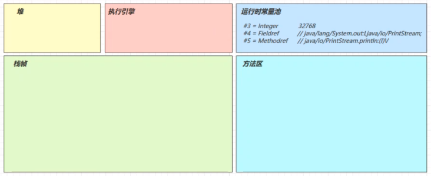

###### 方法字节码载入方法区

（stack=2，locals=4） 对应操作数栈有 2 个空间（每个空间 4 个字节），局部变量表中有 4 个槽位。  
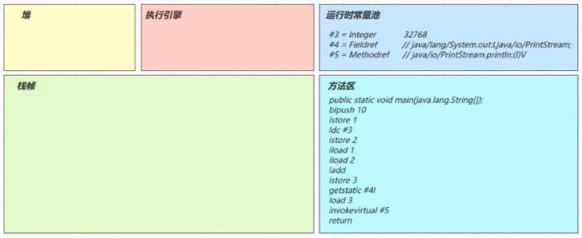

###### main线程开始运行，分配栈帧内存


###### 执行引擎开始执行字节码

bipush 10

- 将一个 byte 压入操作数栈（其长度会补齐 4 个字节），类似的指令还有
- sipush 将一个 short 压入操作数栈（其长度会补齐 4 个字节）
- ldc 将一个 int 压入操作数栈
- ldc2_w 将一个 long 压入操作数栈（**分两次压入**，因为 long 是 8 个字节）
- 这里小的数字都是和字节码指令存在一起，**超过 short 范围的数字存入了常量池**

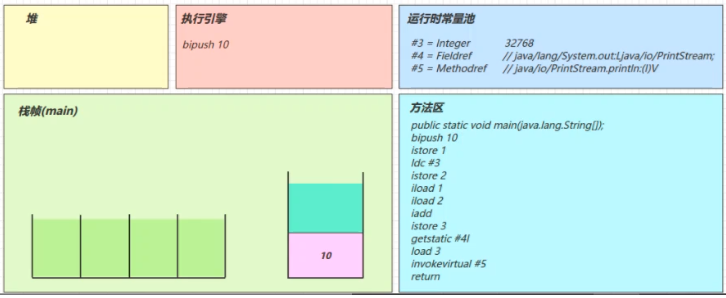

###### istore 1

> 对应代码中的 int a = 10;

将操作数栈栈顶元素弹出，放入局部变量表的 slot 1 中
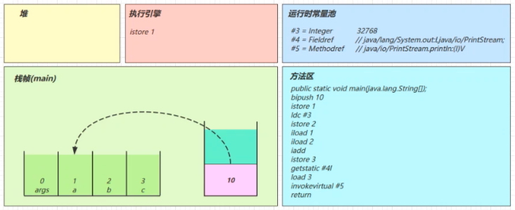
结果


###### ldc #3

> int b = Short.MAX_VALUE + 1;

- 读取运行时常量池中 #3 ，即 32768 (超过 short 最大值范围的数会被放到运行时常量池中)，将其加载到操作数栈中
- 注意 Short.MAX_VALUE 是 32767，所以 32768 = Short.MAX_VALUE + 1 实际是在编译期间计算好的。


###### istore 2

将操作数栈中的元素弹出，放到局部变量表的 2 号位置


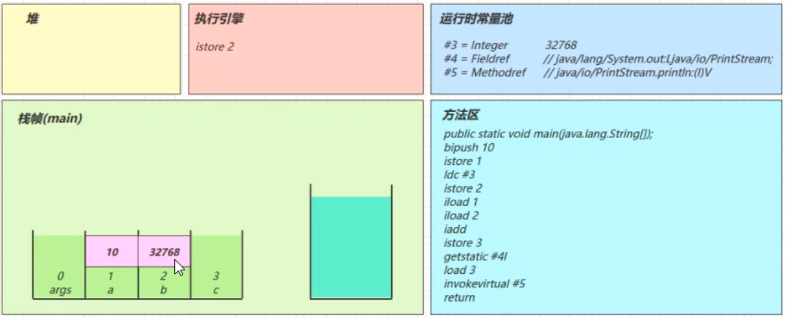

###### iload1 iload2

> int c = a + b;

将局部变量表中 1 号位置和 2 号位置的元素放入操作数栈中。因为只能在操作数栈中执行运算操作  
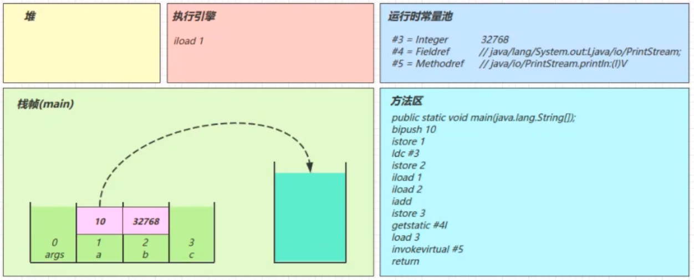


###### iadd

将操作数栈中的两个元素弹出栈并相加，结果在压入操作数栈中。  

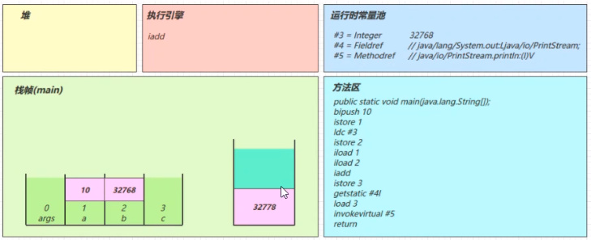

###### istore 3

将操作数栈中的元素弹出，放入局部变量表的3号位置。  

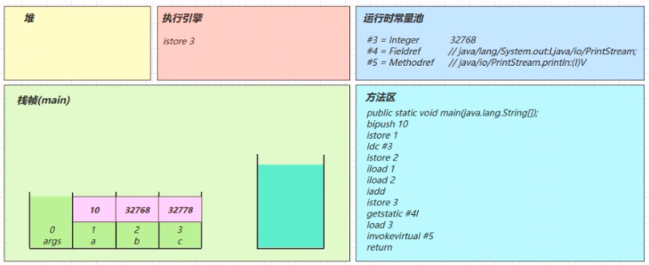

###### getstatic #4

> System.out.println(c);

在运行时常量池中找到 #4 ，发现是一个对象，在堆内存中找到该对象，并将其引用放入操作数栈中  
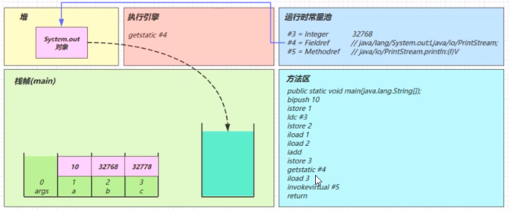
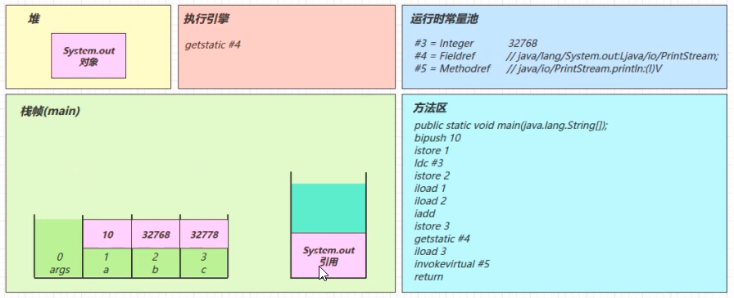

###### iload 3

将局部变量表中 3 号位置的元素压入操作数栈中。  


###### invokevirtual #5

- 找到常量池 #5 项
- 定位到方法区 java/io/PrintStream.println:(I)V 方法
- 生成新的栈帧（分配 locals、stack等）
- 传递参数，执行新栈帧中的字节码

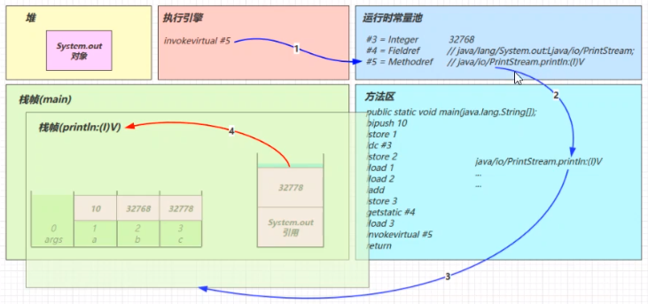

- 执行完毕，弹出栈帧
- 清除 main 操作数栈内容

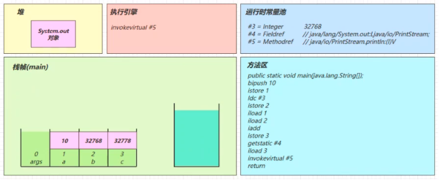

###### return

- 完成 main 方法调用，弹出 main 栈帧
- 程序结束
