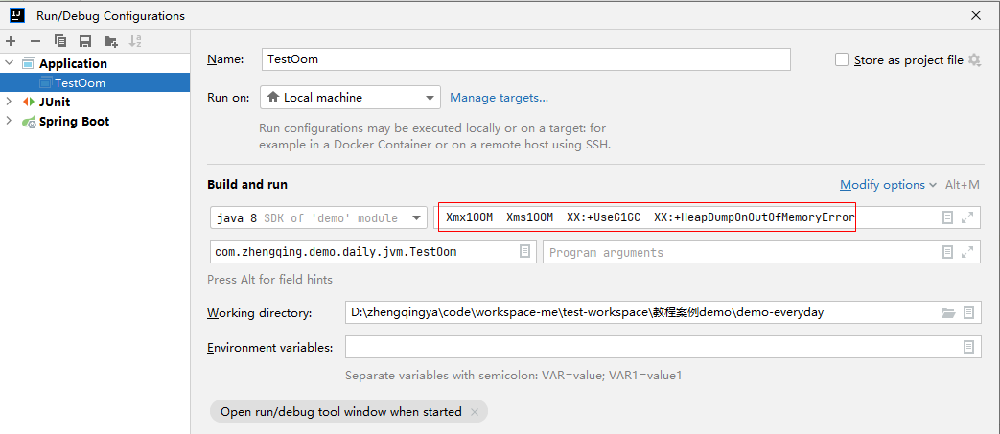
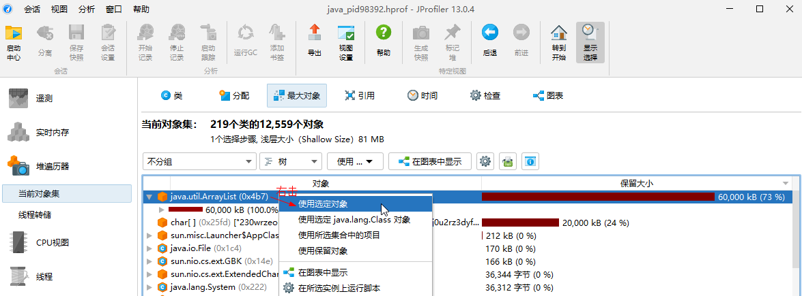
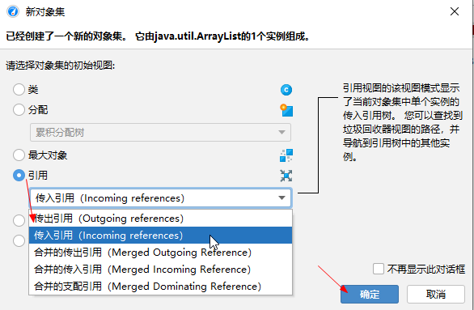
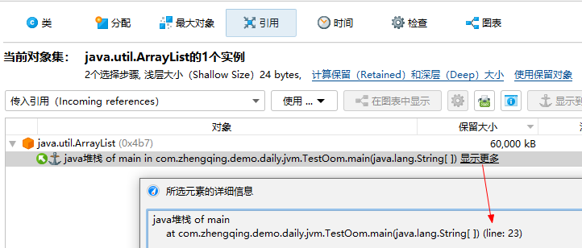
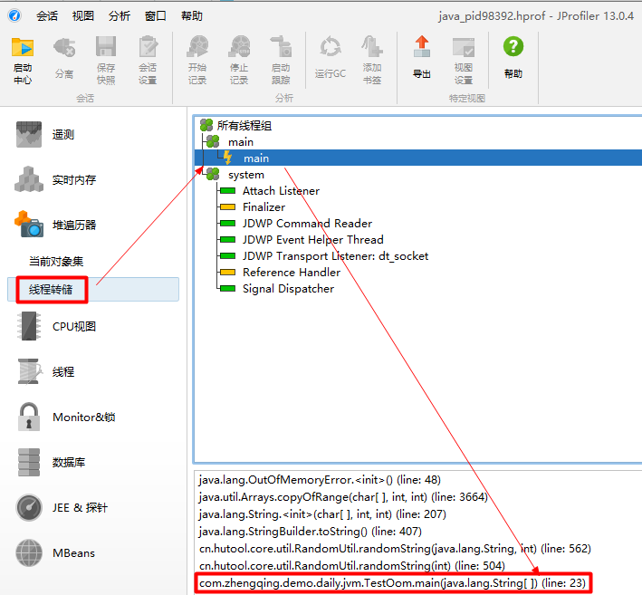

# JProfiler 分析OOM原因

### 一、编写程序测试OOM

```java
public class TestOom {

    public static void main(String[] args) {
        int count = 0;
        try {
            List<String> list = Lists.newArrayList();
            while (true) {
                count++;
                list.add(RandomUtil.randomString(10000000));
            }
        } catch (Error e) {
            System.out.println("count: " + count);
            throw new RuntimeException(e);
        }
    }

}
```

指定jvm运行参数 `-Xmx100M -Xms100M -XX:+UseG1GC -XX:+HeapDumpOnOutOfMemoryError`



运行程序会OOM，在项目目录下生成导出的堆dump文件，比如这里是`java_pid98392.hprof`

```shell
java.lang.OutOfMemoryError: Java heap space
Dumping heap to java_pid98392.hprof ...
Heap dump file created [81983026 bytes in 0.141 secs]
count: 4
Exception in thread "main" java.lang.RuntimeException: java.lang.OutOfMemoryError: Java heap space
	at com.zhengqing.demo.daily.jvm.TestOom.main(TestOom.java:27)
Caused by: java.lang.OutOfMemoryError: Java heap space
	at java.util.Arrays.copyOfRange(Arrays.java:3664)
	at java.lang.String.<init>(String.java:207)
	at java.lang.StringBuilder.toString(StringBuilder.java:407)
	at cn.hutool.core.util.RandomUtil.randomString(RandomUtil.java:562)
	at cn.hutool.core.util.RandomUtil.randomString(RandomUtil.java:504)
	at com.zhengqing.demo.daily.jvm.TestOom.main(TestOom.java:23)
Disconnected from the target VM, address: '127.0.0.1:60094', transport: 'socket'
```

### 二、分析OOM

双击生成的 `java_pid98392.hprof` 文件，自动打开`JProfiler`程序

#### 方式1、通过`最大对象`分析

在最大对象上右击选择`使用选定对象`



引用处选择`传入引用（Incoming references）`查看持有当前对象的引用

> tips: 这里根据情况进行选择



在`显示更多`中可查看问题根源


#### 方式2、通过`具体线程`分析

在OOM日志处，找到相关线程，然后在`JProfiler`中的`线程转储`中查看具体错误



