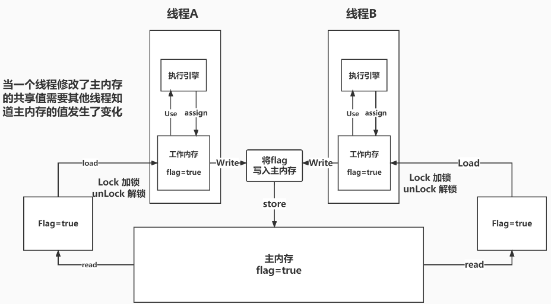

# JMM

### 什么是JMM

JMM是java内存模型，不存在的东西,是概念,是约定.

### 关于JMM的一些同步约定:

1. 线程解锁前,必须立刻把共享遍历刷回主存
2. 线程加锁前,必须读取主存中的最新值到工作内存中
3. 加锁和解锁都是一把锁



### 8种操作

内存交互操作有8种，虚拟机实现必须保证每一个操作都是原子的，不可在分的（对于double和long类
型的变量来说，load、store、read和write操作在某些平台上允许例外）

- lock （锁定）：作用于主内存的变量，把一个变量标识为线程独占状态
- unlock （解锁）：作用于主内存的变量，它把一个处于锁定状态的变量释放出来，释放后的变量
  才可以被其他线程锁定
- read （读取）：作用于主内存变量，它把一个变量的值从主内存传输到线程的工作内存中，以便
  随后的load动作使用
- load （载入）：作用于工作内存的变量，它把read操作从主存中变量放入工作内存中
- use （使用）：作用于工作内存中的变量，它把工作内存中的变量传输给执行引擎，每当虚拟机
  遇到一个需要使用到变量的值，就会使用到这个指令
- assign （赋值）：作用于工作内存中的变量，它把一个从执行引擎中接受到的值放入工作内存的变
  量副本中
- store （存储）：作用于主内存中的变量，它把一个从工作内存中一个变量的值传送到主内存中，
  以便后续的write使用
- write （写入）：作用于主内存中的变量，它把store操作从工作内存中得到的变量的值放入主内
  存的变量中

JMM对这八种指令的使用，制定了如下规则：

- 不允许read和load、store和write操作之一单独出现。即使用了read必须load，使用了store必须write
- 不允许线程丢弃他最近的assign操作，即工作变量的数据改变了之后，必须告知主存
- 不允许一个线程将没有assign的数据从工作内存同步回主内存
- 一个新的变量必须在主内存中诞生，不允许工作内存直接使用一个未被初始化的变量。就是对变量实施use、store操作之前，必须经过assign和load操作
- 一个变量同一时间只有一个线程能对其进行lock。多次lock后，必须执行相同次数的unlock才能解锁
- 如果对一个变量进行lock操作，会清空所有工作内存中此变量的值，在执行引擎使用这个变量前，必须重新load或assign操作初始化变量的值
- 如果一个变量没有被lock，就不能对其进行unlock操作。也不能unlock一个被其他线程锁住的变量
- 对一个变量进行unlock操作之前，必须把此变量同步回主内存

### 测试

```java
package com.zhengqing.demo.daily.juc.jmm;

import java.util.concurrent.TimeUnit;

public class TestJMM {
    private static boolean flag = true;

    public static void main(String[] args) throws Exception {
        new Thread(() -> {
            while (flag) {

            }
        }).start();

        System.out.println("停顿!");
        TimeUnit.SECONDS.sleep(1);
        flag = false;
        System.out.println("修改完毕!");
        //这里直接循环卡死!
    }
}
```