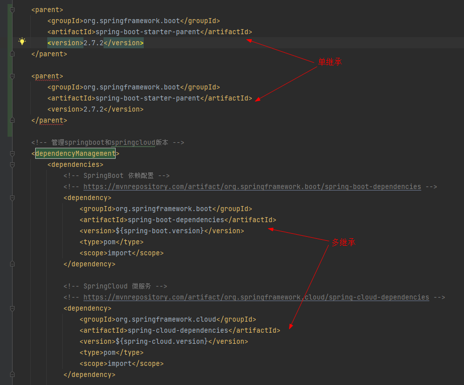

### 依赖作用域

pom.xml

```
<dependencyManagement>
    <dependencies>
        <dependency>
            <groupId>org.springframework.boot</groupId>
            <artifactId>spring-boot-dependencies</artifactId>
            <version>2.7.0</version>
            <type>pom</type>
            <scope>import</scope>
        </dependency>
    </dependencies>
</dependencyManagement>

<dependencies>
    <dependency>
        <groupId>org.springframework.boot</groupId>
        <artifactId>spring-boot-starter-web</artifactId>
    </dependency>

    <dependency>
        <groupId>org.springframework.boot</groupId>
        <artifactId>spring-boot-starter-test</artifactId>
        <scope>test</scope>
    </dependency>
    
    <dependency>
        <groupId>com.zhengqing.common</groupId>
        <artifactId>common</artifactId>
        <version>1.0.0</version>
        <scope>system</scope>
        <systemPath>${pom.basedir}/src/main/resources/lib/common-1.0.0.jar</systemPath>
    </dependency>
    
    <dependency>
         <groupId>com.zhengqing</groupId>
         <artifactId>base</artifactId>
         <scope>provided</scope>
     </dependency>
</dependencies>
```

#### `compile`

默认值，适用于所有阶段，依赖会参与项目的编译、测试和运行阶段，属于强依赖。打包时，会打到包里去，随项目发布。

#### `runtime`

只在运行时使用。
一般这种类库都是接口与实现相分离的类库，ex: JDBC类库，在编译之时仅依赖相关的接口，在具体的运行之时，才需要具体的mysql、oracle等等数据的驱动程序。 此类的驱动都是为runtime的类库。

#### `test`

只在测试时使用，用于编译和运行测试代码。不会随项目发布。

#### `provided`

该依赖可以参与编译、测试和运行等周期，与compile等同。
区别: 在打包时，不需要打进去

#### `system`

使用上与provided相同，不同之处在于该依赖不从maven仓库中提取，而是从本地文件系统中提取，其会参照`systemPath`的属性进行提取依赖。

#### `import`

只能在`dependencyManagement`中使用，能解决maven单继承问题，import的依赖实际上并不参与依赖传递。

ex: 通过`<scope>import</scope>`实现多继承，导入SpringBoot和SpringCloud两个父模块的jar包管理

```
<!-- maven单继承 -->
<parent>
    <groupId>org.springframework.boot</groupId>
    <artifactId>spring-boot-starter-parent</artifactId>
    <version>2.7.2</version>
</parent>

<!-- maven多继承 -->
<dependencyManagement>
    <dependencies>
        <dependency>
            <groupId>org.springframework.boot</groupId>
            <artifactId>spring-boot-dependencies</artifactId>
            <version>2.7.0</version>
            <type>pom</type>
            <scope>import</scope>
        </dependency>
        <dependency>
            <groupId>org.springframework.cloud</groupId>
            <artifactId>spring-cloud-dependencies</artifactId>
            <version>2021.0.2</version>
            <type>pom</type>
            <scope>import</scope>
        </dependency>
    </dependencies>
</dependencyManagement>
```



### 依赖传递性

A -> B -> C

`compile`: A可以使用C的依赖
`test`/`provided`: A不可以使用C的依赖

### `dependency`中的`type`

声明引入依赖的类型`jar、war、pom`等

默认值是`jar`