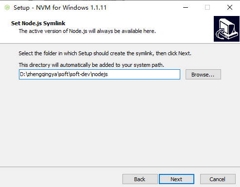
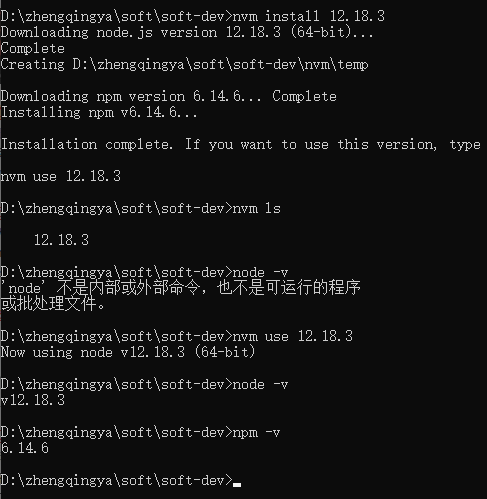

# nvm

nvm（Node.js Version Manager）是一个用于管理 Node.js 版本的工具，可以帮助用户快速切换 Node.js 版本。
通过 nvm，用户可以在同一台计算机同时安装和使用多个不同的 Node.js 版本，并且可以方便地在它们之间进行切换。

> tips: 一定要卸载已安装的 NodeJS，否则会发生冲突。

### 一、windows 安装

下载`nvm-setup.exe` https://github.com/coreybutler/nvm-windows/releases

双击安装



### 二、常用命令 & 安装nodejs

```shell
# 查看版本
nvm -v

# 显示可下载版本的部分列表
nvm list available

# 安装最新版本
nvm install latest
# 安装指定版本的 Node.js，例如 nvm install 16.18.0
nvm install 版本号
# 切换到指定版本的 Node.js 环境，例如 nvm use 16.18.0
nvm use 版本号
# 列出当前已经安装的所有 Node.js 版本，其中带有 * 号的表示当前正在使用的版本
nvm ls

# 卸载指定版本的 Node.js。
nvm uninstall 版本号

# 给一个 Node.js 版本设置别名，例如 nvm alias default 12.18.3 将默认版本设置为 12.18.3
nvm alias 别名 版本号
# 通过设置的别名切换到对应版本的 Node.js，例如 nvm use default
nvm use 别名
```


