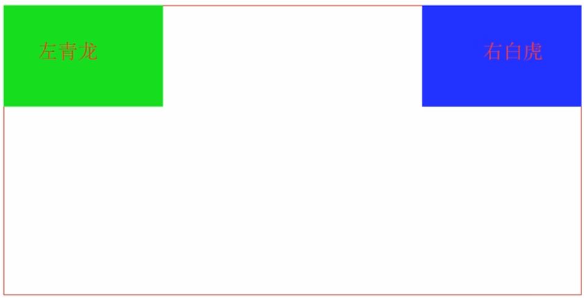
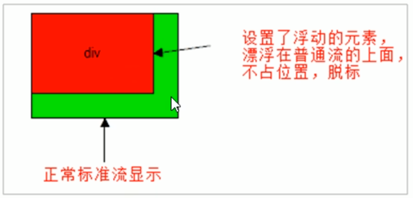
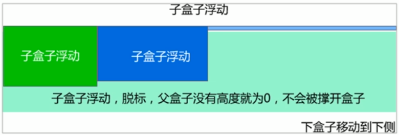
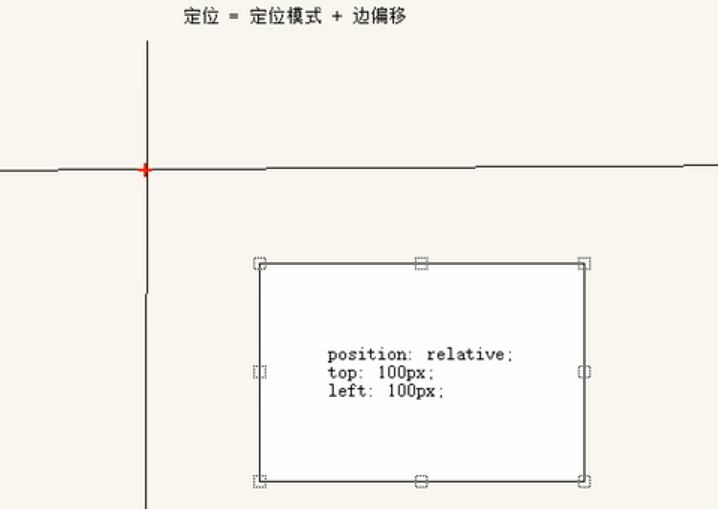

# 传统网页布局的三种方式

网页布局的本质➡用 CSS 来摆放盒子。 把盒子摆放到相应位置

CSS 提供了三种传统布局方式：

* 普通流（标准流）
* 浮动
* 定位

### 1、标准流

所谓的标准流，就是标签按照规定好默认方式排列

1. 块级元素会独占一行，从上向下顺序排列。
   常用元素：div、hr、p、h1~h6、ul、ol、dl、form、table
2. 行内元素会按照顺序，从左到右顺序排列，碰到父元素边缘则自动换行。  
   常用元素：span、a、i、em 等

以上都是标准流布局，我们前面学习的就是标准流，标准流是最基本的布局方式。
这三种布局方式都是用来摆放盒子的，盒子摆放到合适位置，布局自然就完成了。
注意：实际开发中，一个页面基本都包含了这三种布局方式（后面移动端学习新的布局方式） 。

### 2、浮动

1. 提问：如何让多个块级盒子(div)水平排列成一行？
   
   比较难，虽然转换为行内块元素可以实现一行显示，但是他们之间会有大的空白缝隙，很难控制。
2. 提问：如何实现两个盒子的左右对齐？
   

总结： 有很多的布局效果，标准流没有办法完成，此时就可以利用浮动完成布局。 因为浮动可以改变元素标签默认的排列方式.

#### 2.1、浮动的典型应用

* 浮动最典型的应用：`可以让多个块级元素一行内排列显示。`
* 网页布局第一准则：`多个块级元素纵向排列找标准流，多个块级元素横向排列找浮动。`

> 什么是浮动？

* `float`属性用于创建浮动框，将其移动到一边，直到左边缘或右边缘触及包含块或另一个浮动框的边缘

语法：

```
选择器 {
    float: 属性值;
}
```

| 属性值 | 描述 |
| --- | --- |
| none | 元素不浮动 |
| left | 元素向左浮动 |
| right | 元素向右浮动 |

* 网页布局的第一准则：` 多个块级元素纵向排列找标准流，多个块级元素横向排列找浮动`
* 网页布局第二准则：` 先设置盒子大小，之后设置盒子的位置。`

#### 2.2、浮动的特性

设置了浮动（float）的元素的最重要的特性：

1. 脱标：浮动元素会脱离标准流
   浮动的盒子` 不再保留原先的位置`
   
2. 如果多个盒子都设置了浮动，则它们会按照属性值` 一行内显示并且顶端对齐排列`
   
   浮动的元素是相互贴靠在一起的（` 不会有缝隙` ），如果父级宽度装不下这些浮动的盒子，多出的盒子会另起一行对齐。
3. 浮动元素会具有行内块元素特性
   任何元素都可以浮动。不管原先是什么模式的元素，添加浮动之后都具有` 行内块元素` 相似的特性。

* 如果块级盒子没有设置宽度，默认宽度和父级一样宽，但是添加浮动后，它的大小根据内容来决定
* 如果行内元素有了浮动，则不需要转换块级\\行内块元素就可以直接给高度和宽度
* 浮动的盒子中间是没有缝隙的，是紧挨着一起的

#### 2.3、浮动元素经常和标准流父级搭配使用

为了约束浮动元素位置, 我们网页布局一般采取的策略是:

` 先用标准流的父元素排列上下位置，之后内部子元素采取浮动排列左右位置`


#### 2.4、浮动的注意点

* 先用标准流的父元素排列上下位置，之后内部子元素采取浮动排列左右位置
* 一个元素浮动了，理论上其余兄弟元素也要浮动
    * 一个盒子里面有多个子盒子，如果其中一个盒子浮动了，那么其他兄弟也应该浮动
* 浮动的盒子只会影响浮动盒子后面的标准流，不会影响前面的标准流

#### 2.5、清除浮动

我们前面浮动元素有一个标准流的父元素, 他们有一个共同的特点, 都是有高度的.但是, 所有的父盒子都必须有高度吗?
理想中的状态, 让子盒子撑开父亲. 有多少孩子,我父盒子就有多高.
但是不给父盒子高度会有问题吗?..…

> 为什么要清除浮动

* 由于父级盒子很多情况下，不方便给高度，但是子盒子浮动又不占有位置，最后父级盒子高度为0时，就会影响下面的标准流盒子。



* 由于浮动元素不再占用原文档流的位置，所以它会对后面的元素排版产生影响
* 理想中的状态，让子盒子撑开父亲，有多少孩子，我父盒子就有多高

#### 2.6、清除浮动的本质

* 清除浮动的本质是` 清除浮动元素造成的影响`
* 如果父盒子本身有高度，则不需要清除浮动
* 清除浮动之后，父级就会根据浮动的子盒子自动检测高度，父级有了高度，就不会影响下面的标准流了。

语法：

```
选择器 {
    clear: 属性值;
}
```

| 属性值 | 描述 |
| --- | --- |
| left | 不允许左侧有浮动元素(清除左侧浮动的影响) |
| right | 不允许右侧有浮动元素(清除右侧浮动的影响) |
| both | 同时清除左右两侧浮动的影响 |

* 我们实际工作中，几乎只用`clear:both`
* 清除浮动的策略是：` 闭合浮动`
* 只让浮动在父盒子内部影响，不影响父盒子外面的其他盒子。

#### 2.7、清除浮动的方法

1. ` 额外标签法` 也称为隔墙法，是W3C推荐的做法
2. 父级添加 overflow 属性
3. 父级添加 after 伪元素
4. 父级添加双伪元素

##### ①额外标签法

* 额外标签法会在浮动元素末尾添加一个空的标签,例如：
* 例如`<div style="clear:both"></div>`，或者其他标签（如`</br>`等）
* 注意：` 要求这个新的空标签必须是块级元素`
* 优点：通俗易懂，书写方便
* 缺点：添加许多无意义的标签，结构化较差
  实际工作可能会遇到,但是不常用

##### ②overflow

* 可以给父级添加`overflow`属性，将其属性值设置为`hidden`,`auto`或`scroll`
* 优点：代码简洁
* 缺点：无法显示溢出的部分

##### ③after伪元素法

:after 方式是额外标签法的升级版。也是给父元素添加

```
.clearfix:after {
    content: "";
    display: block;
    height: 0;
    clear: both;
    visibility: hidden;
}
.clearfix {
      /* IE6,7专有*/
      *zoom : 1; 
}
```

* 优点：没有增加标签，结构更简单
* 缺点：需要照顾低版本浏览器
* 代表网站：百度、淘宝、网易等

##### ④双伪元素

* 也是给父元素添加

```
.clearfix:before,.clearfix:after{
   content:"";
   display:table;
}
.clearfix:after {
     clear:both;
}
.clearfix {
  *zoom:1;
}
```

* 优点：代码更简洁
* 缺点：需要照顾低版本浏览器
* 代表网站：小米、腾讯等

#### 2.8、浮动总结

为什么需要清除浮动？

- ①：父级没高度
- ②：子盒子浮动了
- ③：影响下面布局了，我们就应该清除浮动了。

| 清除浮动方式 | 优点 | 缺点 |
| --- | --- | --- |
| 额外标签法(隔墙法) | 通俗易懂，书写方便 | 添加许多无意义的标签，结构化较差 |
| 父级overflow:hidden; | 书写简单 | 溢出隐藏 |
| 父级after伪元素 | 结构语义化正确 | 由于IE6-7不支持：after，兼容性问题 |
| 父级双伪元素 | 结构语义化正确 | 由于IE6-7不支持：after，兼容性问题 |

### 3、定位

提问：以下情况使用标准流或者浮动能实现吗？

1. 某个元素可以自由的在一个盒子内移动位置，并且压住其他盒子。
2. 当我们滚动窗口的时候，盒子是固定屏幕某个位置的。

以上效果，标准流或浮动都无法快速实现，此时需要定位来实现

* 浮动可以让多个块级盒子一行没有缝隙的排列显示，经常用于横向排列盒子
* 定位则是可以让盒子自由的在某个盒子内移动位置或固定屏幕中某个位置，并且可以压住其他盒子
* 定位：将盒子定在某一个位置，所以定位也是在摆放盒子，按照定位的方式移动盒子

#### 3.1、定位的组成

定位 = 定位模式 +边偏移

* ` 定位模式用于指定一个元素在文档中的定位方式`
* ` 边偏移则决定了该元素的最终位置`

> 定位模式

* 定位模式决定元素的定位方式 ，它通过 CSS 的 position 属性来设置，其值可以分为四个

| 值 | 语义     |
| --- |--------|
| static | 静态定位(默认) |
| relative | 相对定位   |
| absolute | 绝对定位   |
| fixed | 固定定位   |

> 边偏移

边偏移就是定位的盒子移动到最终位置。

| 边偏移属性 | 示例 | 描述 |
| --- | --- | --- |
| top | top: 80px | 顶端偏移量，定义元素相对于其父元素的` 上边线的距离`  |
| bottom | bottom: 80px | 底部偏移量，定义元素相对于其父元素的` 下边线的距离`  |
| right | right: 80px | 右侧偏移量，定义元素相对于其父元素` 右边线的距离`  |
| left | left: 80px | 左侧偏移量，定义元素相对于其父元素` 左边线的距离`  |

#### 3.2、静态定位static(了解)

* 静态定位是元素的`默认定位方式，无定位` 的意思
* 静态定位按照标准流特性摆放位置，它没有边偏移

```
选择器 {
	position: static;
}
```

##### 3.3、相对定位relative

* 相对定位是元素在移动位置的时候，是相对于它` 原来的位置` 来说的
* ` 特点：`
    * 它是相对于自己原来的位置来移动的（移动位置的时候参照点是自己原来的位置）
    * 原来在标准流的位置继续占有，后面的盒子仍然以标准流的方式对待。（不脱标，继续保留原来位置）
    * 因此，相对定位并没有脱标，它最典型的应用是给绝对定位当爹的。



#### 3.4、绝对定位absolute

* 绝对定位是元素在移动位置的时候，是相对于它的祖先元素来说的
* ` 特点：`
    * 如果没有祖先元素，或者祖先元素没定位，则以浏览器为准进行定位(Document 文档)
    * 如果祖先元素父级有定位(相对、绝对、固定定位)，则以最近一级的有定位祖先元素为参考点移动位置
    * 绝对定位不再占用原先的位置（脱标）

所以绝对定位是脱离标准流的

##### 绝对定位盒子水平居中

* 加了绝对定位的盒子不能通过`margin: 0 auto`水平居中
* 但是可以通过以下计算方法实现水平和垂直居中
    * `left:50%` ； 让盒子的左侧移动到父级元素的水平中心位置
    * `margin-left: -100px`; 让盒子向左移动自身宽度的一半

```
.box {
    position: absolute;
    /* 1.left走50%，父容器宽度的一半 */
    left: 50%;
    /* 2.margin 负值往左边走 自己盒子宽度的一半 */
    margin-left: -xx;
}
```

#### 3.5、子绝父相

意思：` 子级使用绝对定位，父级则需要相对定位`

- ①：子级绝对定位，不会占有位置，可以放到父盒子里面的任何一个地方，不会影响其他的兄弟盒子。
- ②：父盒子需要加定位限制子盒子在父盒子内显示
- ③：父盒子布局时，需要占有位置，因此父亲只能是相对定位。

总结：` 因为父级需要占有位置，因此是相对定位，子盒子不要占有位置，则是绝对定位`

#### 3.6、固定定位fixed

` 固定定位` 是元素` 固定于浏览器的可视区的位置`

主要使用场景： 可以在浏览器页面滚动时元素的位置不会改变

* ` 特点 ` ：
    * 以浏览器的可视窗口为参照点移动元素
    * 跟父元素没有任何关系
    * 不随滚动条滚动
    * 固定定位` 不再占有原先的位置` (脱标)

固定定位也是脱标的，其实固定定位也可以看做是一种特殊的绝对定位。

##### 👉固定定位小技巧

固定定位小技巧： 固定在版心右侧位置

小算法：

1. 让固定定位的盒子 left: 50%. 走到浏览器可视区（也可以看做版心） 的一半位置。
2. 让固定定位的盒子 margin-left: 版心宽度的一半距离。 多走 版心宽度的一半位置

就可以让固定定位的盒子贴着版心右侧对齐了。

```
.box {
    position: absolute;
    /* 1.left走50%，父容器宽度的一半 */
    left: 50%;
    /* 2.margin 负值往左边走 自己盒子宽度的一半 */
    margin-left: -xx;
}
```

#### 3.7、粘性定位sticky(了解)

粘性定位可以被认为是相对定位和固定定位的混合

* ` 特点：`
    * 以浏览器的可视窗口为参照点移动元素（固定定位特点）
    * 粘性` 定位占有原先的位置` （相对定位的特点）
    * 必须添加top，left，right，bottom其中一个才有效

跟页面滚动搭配使用。 兼容性较差，IE 不支持。

```
选择器 {
    position:sticky;  
	top: 10px;
}
```

#### 3.8、定位模式总结

| 定位模式 | 是否脱标 | 移动位置 | 是否常用 |
| --- | --- | --- | --- |
| static静态定位 | 否 | 不能使用边偏移 | 很少 |
| ` relative相对定位`  | ` 否（占有位置）`  | ` 相对于自身位置移动`  | ` 常用`  |
| ` absolute绝对定位`  | ` 是（不占有位置）`  | ` 带有定位的父级`  | ` 常用`  |
| ` fixed固定定位`  | ` 是（不占有位置）`  | ` 浏览器可视区`  | ` 常用`  |
| sticky | 否（占有位置） | 浏览器可视区 | 当前阶段少 |

* 一定要记住相对定位，固定定位，绝对定位的两个大特点：1.是否占有位置（脱标否）2.以谁为基准点移动
* 重点学会子绝父相（儿子绝对定位，父亲必须相对定位）

#### 3.9定位叠放次序z-index

* 在使用定位布局时候，可能会出现盒子重叠的情况
* 此时，可以用 z-index 来控制盒子的前后次序(z轴)

```
选择器 {
    z-index: 1; 
}
```

1. 数值可以是正整数，负整数或者0，默认是auto，数值越大，盒子越靠上
2. 如果属性值相同，则按照书写顺序，后来居上
3. 数字后面不能加单位
4. ` 只有定位` 的盒子才有 z-index 属性

#### 3.10、定位的扩展

1. ✍绝对定位的盒子居中
   加了绝对定位的盒子不能通过 margin: 0 auto 水平居中，但是可以通过以下计算方法实现水平和垂直居中
   ①：left: 50%; 让盒子的左侧移动到父级元素的水平中心位置
   ②：margin-left: -100px; 让盒子向左移动自身宽度的一半
2. ✍定位特殊特性
   绝对定位和固定定位也和浮动类似。
   ①：行内元素添加绝对或者固定定位，可以直接设置高度和宽度
   ②：块级元素添加绝对或者固定定位，如果不给宽度或者高度，默认大小是内容的大小。
3. ✍脱标的盒子不会触发外边距塌陷
   浮动元素、绝对定位(固定定位)元素都不会触发外边距合并的问题。
4. ✍绝对定位(固定定位)会完全压住盒子
   ①：浮动元素不同，只会压住它下面标准流的盒子，但是不会压住下面标准流盒子里面的文字（图片）
   ②：但是绝对定位（固定定位） 会压住下面标准流所有的内容。
   ③：浮动之所以不会压住文字，因为浮动产生的目的最初是为了做文字环绕效果的。 文字会围绕浮动元素

### 4、网页布局总结

通过盒子模型，清楚知道大部分html标签是一个盒子
通过CSS浮动、定位 可以让每个盒子排列成为网页
一个完整的网页，是标准流、浮动、定位一起完成布局的，每个都有自己的专门用法

1. 标准流
   可以让盒子上下排列或者左右排列，` 垂直的块级盒子显示就用标准流布局。`
2. 浮动
   可以让多个块级元素一行显示或者左右对齐盒子，` 多个块级盒子水平显示就用浮动布局。`
3. 定位
   定位最大的特点是有层叠的概念，就` 是可以让多个盒子前后叠压来显示。如果元素自由在某个盒子内移动就用定位布局。` 
