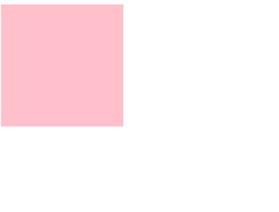

# CSS3 其他特性

### 1、滤镜filter

`filter`: CSS属性将模糊或颜色偏移等图形效果应用于元素(图片变模糊)

语法：filter: 函数();

模糊处理：`blur`,数值越大越模糊


```
<head>
   <style>
        img {
            /* blur 是一个函数，小括号里面的数值越大，图片越模糊，注意数值要加px单位 */
            filter: blur(5px);
        }
    </style>
</head>

<body>
    
</body>
```

### 2、calc函数

`calc()` 此CSS函数让你在声明CSS属性值时执行一些计算（计算盒子宽度 width: calc 函数） eg: `width:calc(100% - 80px);`

括号里面可以使用 `+ - * /` 来进行计算

```
<head> 
   <style>
        .father {
            width: 300px;
            height: 200px;
            background-color: pink;
        }
        
        .son {
            /* width: 150px; */
            /* son盒子和父亲一样宽，都是100%，son盒子-30px */
            width: calc(100%-30px);
            height: 30px;
            background-color: skyblue;
        }
    </style>
</head>

<body>
    <!-- 需求：我们的子盒子宽度永远比父盒子小30像素 -->
    <div class="father">
        <div class="son"></div>
    </div>
</body>
```


### 3、transition过渡

- `过渡（transition)` 是CSS3中具有颠覆性的特征之一，我们可以在不使用 Flash 动画或JavaScript 的情况下，当元素从一种样式变换为另一种样式时为元素添加效果
- 过渡动画：是从一个状态渐渐的过渡到另外一个状态
- **过渡经常和：hover一起搭配使用**

```
transition: 要过渡的属性 花费时间 运动曲线 何时开始;
```

1. `要过渡的属性`：想要变化的 CSS 属性，宽度高度，背景颜色，内外边距都可以，如果想要所有的属性都变化过渡，写一个all就可以。
2. `花费时间`：单位是秒(必须写单位) 比如0.5s
3. `运动曲线`：默认是ease(可以省略)
4. `何时开始`：单位是秒(必须写单位)，可以设置延迟触发事件，默认是0s(可以省略)


过渡的口诀：谁做过渡给谁加

```
<head>
   <style>
        div {
            width: 200px;
            height: 100px;
            background-color: pink;
            /* transition: 变化的属性 花费时间 运动曲线 何时开始; */
            /* 如果想要写多个属性，利用逗号进行分割 */
            transition: width 0.5s, height 0.5s;
            /* 如果想要多个属性都变化，属性写all就可以了 */
            transition: all 0.5s;
        }
        
        div:hover {
            width: 400px;
            height: 200px;
            background-color: red;
        }
    </style>
</head>

<body>
    <div></div>
</body>
```


### 4、2D转换

`转换(transform)`是CSS3中具有颠覆性的特征之一，可以实现元素的位移，旋转，缩放等效果

* 移动：translate
* 旋转：rotate
* 缩放：scale

二维坐标系：

2D转换是改变标签在二维平面上的位置和形状的一种技术，先来学习二维坐标系


#### ①移动translate

2D移动是2D转换里面的一种功能，可以改变元素在页面中的位置，**类似**定位。

语法：

```
transform:translate(x,y); 
/* 或者分开写 */
transform:translateX(n);
transform:translateY(n);

transform:translate(100px,100px);
/* 如果只移动X轴           */
transform:translate(100px,0);
translateX(100px);
```

1. 定义2D转换中的移动，沿着X和Y轴移动元素
2. translate 最大的优点：**不会影响到其他元素的位置**
3. translate 中的百分比单位是**相对于自身元素**的
    * `translate:(50%,50%);`
4. 对行内标签没有效果

#### ②旋转rotate

2D旋转指的是让元素在2维平面内顺时针旋转或者逆时针旋转。

```
transform: rotate(度数)
```

1. rotate 里面跟度数，单位是 deg 比如 rotate(45deg)
2. **角度为正时，顺时针，负时，为逆时针**
3. 默认旋转的中心点是元素的中心点

```
<head>
   <style>
        img {
            width: 150px;
            border-radius: 50%;
            border: 5px solid pink;
            /* 过渡写到本身，谁做动画给谁加 */
            transition: all 0.3s;
        }
        
        img:hover {
            transform: rotate(360deg);
        }
    </style>
</head>

<body>
    
</body>
```

#### ③旋转中心点transform-origin

2D转换中心点：我们可以设置元素转换的中心点 transform-origin

```
transform-origin: x y;
```

1. 注意后面的参数x 和 y 用空格隔开
2. x y **默认**转换的中心点是元素的中心点(50% 50%)
3. 还可以给x y 设置 像素或者方位名词(top bottom left right center)

```
<head>
   <style>
        div {
            width: 200px;
            height: 200px;
            background-color: pink;
            margin: 100px auto;
            transition: all 1s;
            /* 1.可以跟方位名词 ,以左下角为轴进行旋转*/
            transform-origin: left bottom;
        }
        
        div:hover {
            transform: rotate(360deg);
        }
    </style>
</head>

<body>
    <div></div>
</body>
```


### 5、缩放scale

缩放：`scale`,只要给元素添加上了这个属性就能控制它放大还是缩小

```
transform: scale(x,y);
```

1. 注意其中的x和y用逗号分割
2. `transform:scale(1,1)`: 宽和高都放大一倍，相当于没有放大
3. `transform:scale(2,2)`：宽和高都放大了2倍
4. `transform:scale(2)`：只写一个参数，第二个参数则和第一个参数一样，相当于 `scale(2,2)`
5. `transform:scale(0.5,0.5)`：缩小
6. sacle缩放最大的优势：可以设置转换中心点缩放，默认以中心点缩放的，而且不影响其他盒子

```
<head>
   <style>
        div {
            width: 200px;
            height: 200px;
            background-color: pink;
            margin: 100px auto;
        }
        
        div:hover {
            /* 1.里面写的数字不跟单位 就是倍数的意思 1就是1倍，2就是2倍 */
            transform: scale(2, 2);
        }
    </style>
</head>

<body>
    <div></div>
</body>
```


### 6、2D转换综合写法

1. 同时使用多个转换，其格式为: transform:translate() rotate() scale() 移动-旋转-缩放
2. 其顺序会影响转换的效果(先旋转会改变坐标轴方向)
3. **当我们同时有位移和其他属性时候，记得要将位移放到最前面**

```
<head>   
   <style>
        div {
            width: 200px;
            height: 200px;
            background-color: pink;
            transition: all .5s;
        }
        
        div:hover {
            /* 我们同时有位移和其他属性，我们需要把位移放到最前面 位移，旋转，缩放*/
            transform: translate(150px, 50px) rotate(180deg) scale(1.2);
        }
    </style>
</head>

<body>
    <div></div>
</body>
```



### 7、2D转换总结

* 转换transform 我们简单理解就是变形 有2D 和 3D 之分
* 我们暂且学了三个 分别是 位移 旋转 和 缩放
* 2D 移动 translate(x, y) 最大的优势是不影响其他盒子， 里面参数用%，是相对于自身宽度和高度来计算的
* 可以分开写比如 translateX(x) 和 translateY(y)
* 2D 旋转 rotate(度数) 可以实现旋转元素 度数的单位是deg
* 2D 缩放 sacle(x,y) 里面参数是数字 不跟单位 可以是小数 最大的优势 不影响其他盒子
* 设置转换中心点 transform-origin : x y; 参数可以百分比、像素或者是方位名词
* **当我们进行综合写法，同时有位移和其他属性的时候，记得要将位移放到最前**
