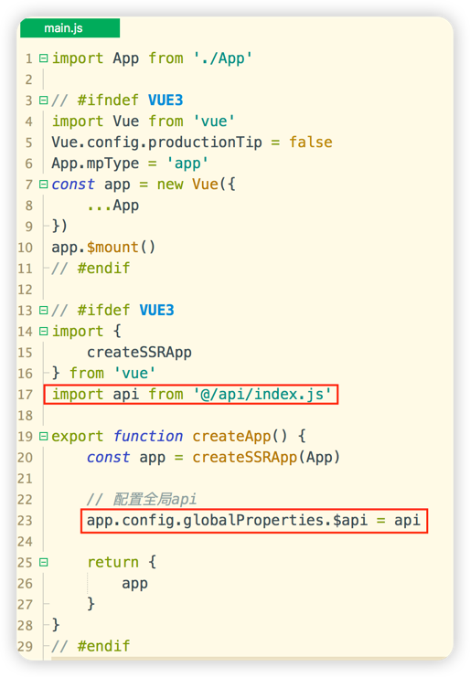

# 模块化封装接口请求

### uni-app提供的网络请求

> https://uniapp.dcloud.net.cn/api/request/request.html

```
uni.request({ 
        url: "http://127.0.0.1/web/api/demo/test/time",
        data: { },
        success: res => { 
            console.log(res)
        }
})
```

### 将`uni.request`进行二次封装

#### 1、新建一个`utils/request.js`文件

```js
const BASE_URL = "http://localhost:80" //公共请求头

const request = ({
                     url,
                     method,
                     data,
                     headers
                 }) => {
    return new Promise((resolve, reject) => {
        if (!headers) {
            headers = {
                'Content-Type': 'application/json;charset=utf-8',
                'Authorization': "---",
                'TENANT_ID': 1
            }
        }
        uni.request({
            url: BASE_URL + url,
            data: data,
            method: method,
            header: headers,
            // 收到开发者服务器成功返回的回调函数
            success: (res) => {
                // console.log(666, res)
                const {
                    code,
                    msg
                } = res.data
                if (code == 200) {
                    return resolve(res.data.data)
                }
                uni.showToast({
                    icon: 'none',
                    duration: 3000,
                    title: msg
                });
                return reject(msg)
            },
            // 接口调用失败的回调函数
            fail(error) {
                alert(1)
                return reject(error)
            },
            // 接口调用结束的回调函数（调用成功、失败都会执行）
            complete() {
            }
        });
    })
}


//向外暴露request
export default request
```

#### 2、模块化api

`api/index.js`

```js
// 拿到所有api
const modulesFiles = import.meta.globEager('./*/*.*')
const modules = {}
for (const key in modulesFiles) {
    const moduleName = key.replace(/(.*\/)*([^.]+).*/gi, '$2')
    const value = modulesFiles[key]
    if (value.default) {
        // 兼容js
        modules[moduleName] = value.default
    } else {
        // 兼容ts
        modules[moduleName] = value
    }
}
// console.log(666, modules);
export default modules
```

#### 3、配置全局变量api

`main.js`

```js
import {
    createSSRApp
} from 'vue'
import api from '@/api/index.js'

export function createApp() {
    const app = createSSRApp(App)

    // 配置全局api
    app.config.globalProperties.$api = api

    return {
        app
    }
}
```



#### 4、测试

`api/pms/spu.js`

```js
import request from '@/utils/request'

const BASE_API = '/web/api/demo/test'

export default {
    test() {
        return request({
            url: BASE_API + '/time',
            method: 'get'
        })
    }
}
```

`pages/product.vue`

```
async test() {
    let res = await this.$api.spu.test()
    console.log(res)
}
```