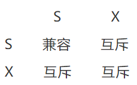

# 共享/排它锁(Shared and Exclusive Locks)

行级锁，S锁与X锁，强锁；

1. 事务拿到某一行记录的共享S锁，才可以`读取`这一行；
2. 事务拿到某一行记录的排它X锁，才可以`修改`或者`删除`这一行；



即：

1. 多个事务可以拿到一把S锁，`读读可以并行`；
2. 而只有一个事务可以拿到X锁，`写写/读写必须互斥`；

共享/排它锁的潜在问题是，不能充分的并行，解决思路是数据多版本

```
# [共享锁] -- 允许不同事务之间加共享锁读取，但不允许其它事务修改或者加入排它锁；如果有修改必须等待一个事务提交完成，才可以执行，容易出现死锁
# 保证所有人查到的数据是最新数据，应用场景：主从库数据同步
select ... lock in share mode;

# [排它锁] -- 当一个事务加入排它锁后，不允许其他事务加共享锁或者排它锁读取，更加不允许其他事务修改加锁的行
# 查到的数据确保是最新数据，并且查到后的数据只允许自己来修改的时候，应用场景：库存，并发
select ... for update;
```

---

### 测试

```
CREATE TABLE `t` (
  `id` int(10) NOT NULL AUTO_INCREMENT,
  `name` varchar(50) DEFAULT NULL,
  PRIMARY KEY (`id`)
) ENGINE=InnoDB DEFAULT CHARSET=utf8mb4;

insert into t(name) values(1);
insert into t(name) values(2);
insert into t(name) values(3);
```

#### 共享锁

##### 读取

```
-- 事务A[共享锁]
START transaction;
select * from t where id = 1 lock in share mode; -- 正常

-- 事务B[共享锁]
START transaction;
select * from t where id = 1 lock in share mode; -- 正常

-- 事务C[排它锁]
START transaction;
select * from t where id = 1 for update; -- 异常，无法正常获取数据，这时候需要其它事务提交或直到超时报错“1205 - Lock wait timeout exceeded; try restarting transaction”
```

##### 更新

```
-- 事务A
START transaction;
select * from t where id = 1 lock in share mode; -- 读数据正常
update t set name = 'aa' where id = 1;           -- 写数据正常

-- 事务B （因为事务A中有写数据，互斥了...）
START transaction;
select * from t where id = 1 lock in share mode; -- 读数据异常
update t set name = 'aa' where id = 1;           -- 写数据异常
```

#### 排它锁

##### 读取

```
-- 事务A[排它锁] -- 正常
START transaction;
select * from t where id = 1 for update;

-- 事务B[共享锁]
START transaction;
select * from t where id = 1 lock in share mode; -- 异常，无法正常获取数据，这时候需要其它事务提交或直到超时报错“1205 - Lock wait timeout exceeded; try restarting transaction”

-- 事务C[排它锁]
START transaction;
select * from t where id = 1 for update; -- 异常，无法正常获取数据，这时候需要其它事务提交或直到超时报错“1205 - Lock wait timeout exceeded; try restarting transaction”
```

##### 更新

```
-- 事务A
START transaction;
select * from t where id = 1 for update; -- 读数据正常
update t set name = 'aa' where id = 1;   -- 写数据正常

-- 事务B（因为事务A中有写数据，互斥了...）
START transaction;
select * from t where id = 1 for update; -- 读数据异常
update t set name = 'aa' where id = 1;   -- 写数据异常
```
