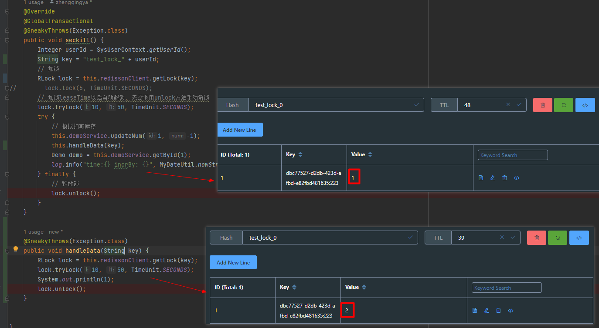
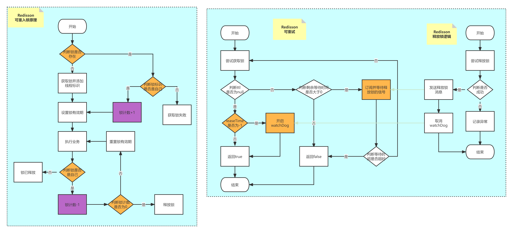

# 分布式锁

基于`setnx`实现的分布式锁存在如下问题：

1. 不可重入：同一个线程无法多次获取同一把锁
2. 不可重试：获取锁只尝试一次就返回false，没有重试机制
3. 超时释放：由于业务执行耗时长，导致锁释放，存在安全隐患
4. 主从一致性：在redis主从集群环境下，主从同步存在一定延迟，一线程从主拿到一把锁，当主宕机时，如果从未及时同步主中的锁数据，其它线程就会去拿到从中的锁，出现问题。

### Redisson

1. https://github.com/redisson/redisson/wiki/%E7%9B%AE%E5%BD%95
2. https://www.bookstack.cn/read/redisson-wiki-zh/Redisson%E9%A1%B9%E7%9B%AE%E4%BB%8B%E7%BB%8D.md

#### 可重入锁

利用redis的hash结构存储锁，key值随意，field属性为线程标识，value为锁次数。
当线程获取一次锁后，如果此时redis中没有这个锁，则创建并将锁次数置为1；
接下来如果线程再次获取锁会进行一次判断。
即对比线程标识是否是同一个线程的多次获取，如果是的话锁次数+1。
同样的，如果是释放锁的话也需要对线程标识进行判断，然后让对应的锁次数-1，当锁的次数为0时，表示此时可以删除锁了。

