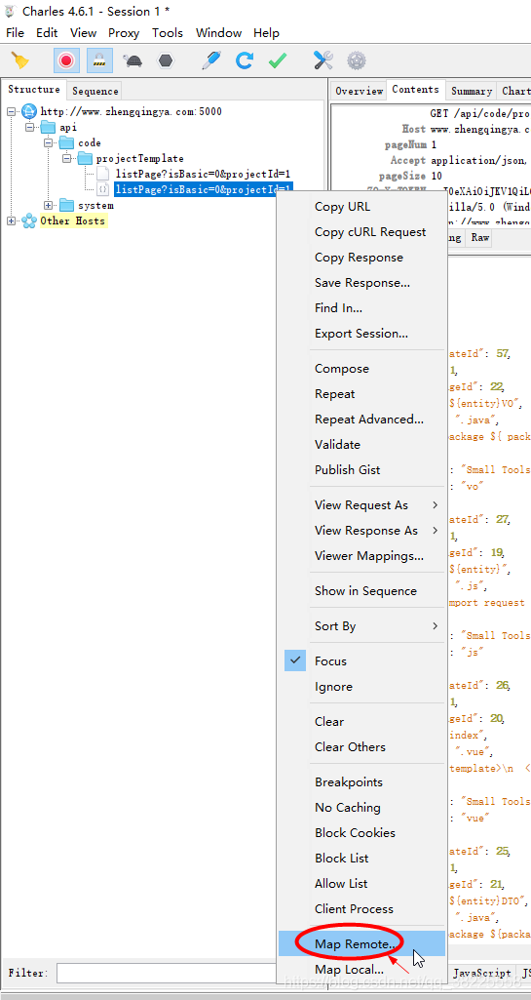
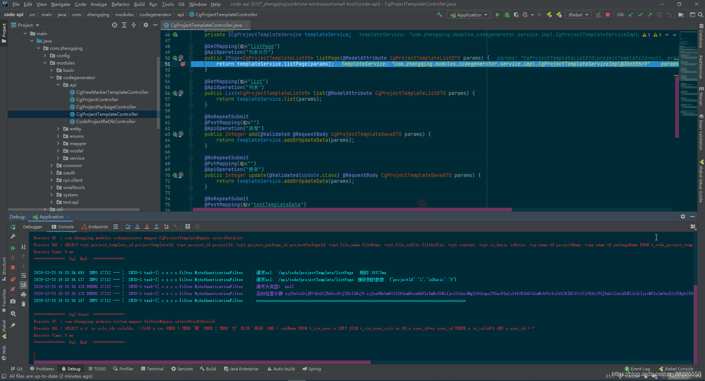
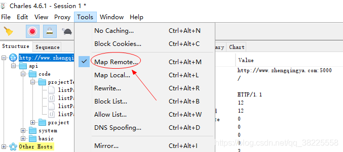
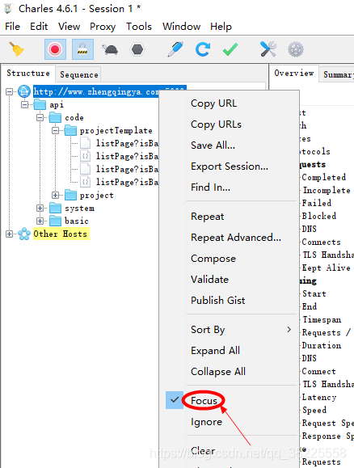
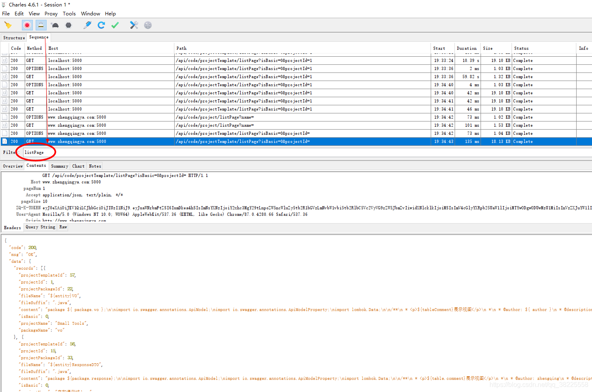

### 一、前言

`Charles`是`HTTP代理`/ `HTTP监视器`/`反向代理`，使开发人员可以查看其计算机与Internet之间的所有HTTP和SSL / HTTPS通信。这包括请求，响应和HTTP标头（其中包含cookie和缓存信息）

> Charles下载地址：  [https://www.charlesproxy.com/download/](https://www.charlesproxy.com/download/)

本文将基于`Charles`进行请求转发，主要是将线上环境的api请求转发到本地方便开发进行测试

> 也可通过其它方式实现，ex: nginx配置引流测试

### 二、请求转发

这里举例线上环境地址 [http://www.zhengqingya.com](http://www.zhengqingya.com)

在线上访问数据之后，Charles中会记录api请求

在需要进行转发的api请求上右击选择`Map Remote...`

配置转发到本地的路径

然后再访问线上环境，就会发现已经将请求转发到本地来了，这样我们就可以进行奇奇怪怪的debug调试了...

如果没有效果的话，检查下`Tools` -> `Map Remote...` 中是否启用

### 三、其它

> 这里简单说下api过滤，即只要我们需要的api

###### 法一：`Structure`模式 选择 `Focus`

###### 法二：`Sequence`模式 使用`Filter`

