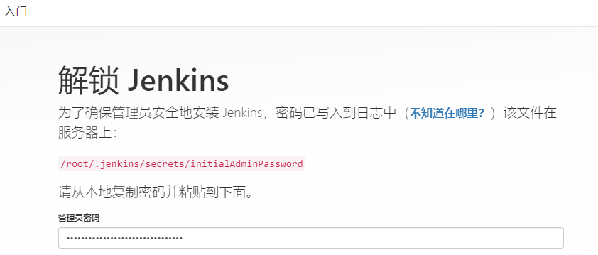

# Linux 安装 Jenkins

> https://www.jenkins.io/zh/download
> 注意看下对应jdk版本要求 https://mirrors.jenkins.io/war

```shell
# 创建目录
mkdir -p /home/soft/jenkins
cd /home/soft/jenkins

# 下载 【 根据自己需要的版本下载 http://mirrors.jenkins.io/war-stable/ 】
wget  http://mirrors.jenkins.io/war-stable/2.346.1/jenkins.war
```

运行

```shell
# 这里指定端口10000运行
nohup java -jar jenkins.war --ajp13Port=-1 --httpPort=10000 --prefix=/jenkins > jenkins.log  2>&1 &
```

或 通过脚本[jenkins.sh](jenkins.sh) 运行

```shell
sh jenkins.sh start/stop/restart
```

访问`IP:10000/jenkins`




---

其它

```shell
# 关闭jenkins
http://ip:10000/jenkins/exit 

# 重启jenkies
http://ip:10000/jenkins/restart 

# 重新加载配置信息
http://ip:10000/jenkins/reload 
```