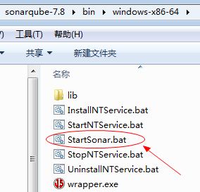
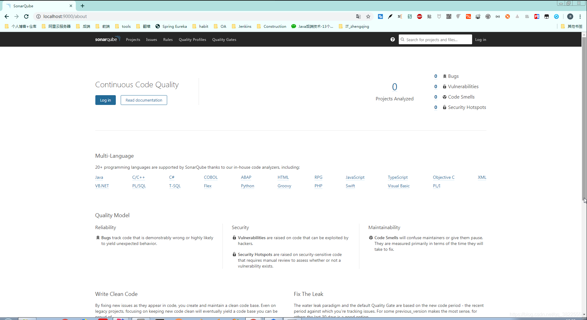
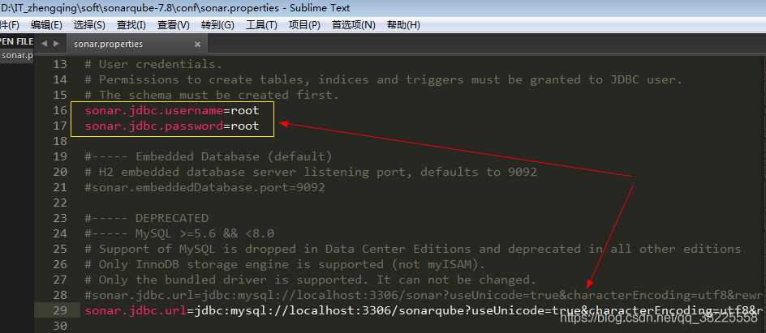
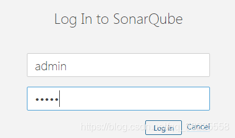
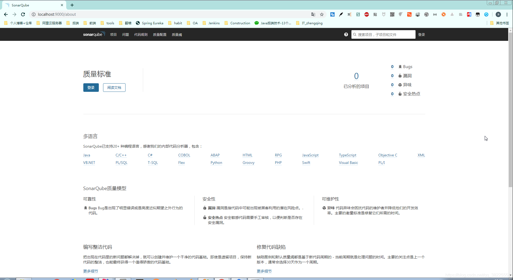
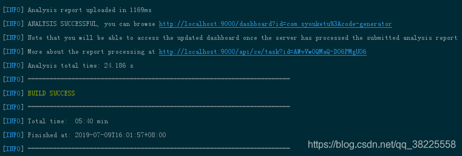
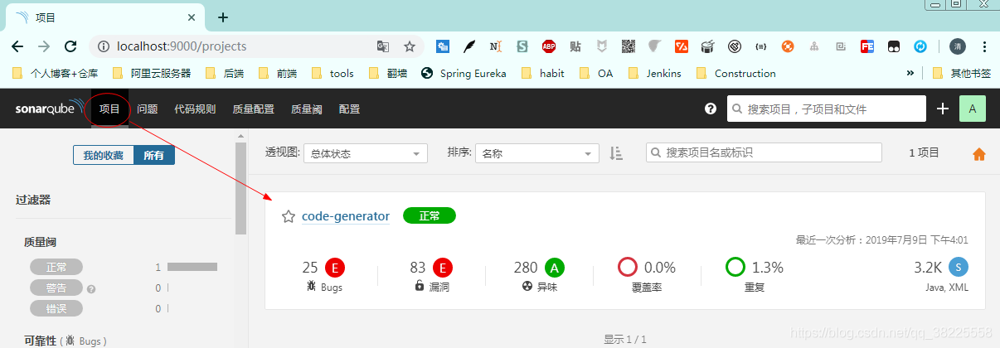

### 一、前言

持续集成管理平台不只是CI服务器，是一系列软件开发管理工具的组合。

- 源码版本管理：svn、git
- 项目构建工具：Maven、Ant
- 代码质量管理：Sonar（Checkstyle、PMD、FindBugs……）
- 持续集成引擎：Hudson、Jenkins、Apache Continuum
- 应用持续部署：操作系统、JDK、Tomcat、JBoss…

**注**：实现持续集成过程中还要用到其他各种工具、各种插件...

### 二、代码质量管理平台 -> SonarQube

SonarQube是一种自动代码审查工具，用于检测代码中的错误，漏洞以及代码异常。它可以与您现有的工作流程集成，以便在项目分支和拉取请求之间进行连续的代码检查。

> **静态代码分析工具**：Checkstyle，FindBugs，PMD，Sonar
> **思路**：我们可以先安装SonarQube，然后在sonarqube中安装checkstyle、findbugs、pmd插件，最后在jenkins中通过sonar scanner
> runner进行远程调用集成sonarqube，使用checkstyle、findbugs、pmd提高我们的代码质量！
> **温馨小提示**：
> 1. 注意下载SonarQube的时候一定要根据自己的jdk以及mysql版本去下载对应的SonarQube版本！不然后面启动会出现自动停止！！！
> 2. jenkins插件sonar scanner runner的版本要和sonarqube server的版本匹配！
> 3. 两者使用的jdk版本也要对应一致！
>
> **了解**：CI服务器 -> 持续集成服务器，CI Server会自动完成软件代码的编译和测试过程，我们可以通过使用Jenkins搭建CI服务器

###### SonarQube官方文档：https://docs.sonarqube.org/

#### 1、下载SonarQube运行测试

###### 小编基本环境

1. windows系统
2. jdk1.8.0_131
3. mysql5.7版本
4. maven3.6.1

> **温馨小提示**：
> 1. 小编刚开始直接下载的是SonarQube最新版7.9，后来发现它配置文件中没有mysql配置，并且启动后自动停止，于是下载了官方提供的7.8版本，看了一下是支持mysql配置的！
> 2. 注意sonarqube中关于mysql版本的要求！

##### SonarQube下载地址：https://www.sonarqube.org/downloads/

下载完后直接解压即可~

进入bin目录下选择自己相应的环境双击 **StartSonar.bat** 启动运行测试

启动成功后，可访问 http://localhost:9000  【sonarqube 默认启动端口为：9000】


#### 2、SonarQube配置

修改在conf目录下 **sonar.properties** 配置文件 【其它的一些配置根据自己情况去除注释修改即可~】

```
sonar.jdbc.username=root
sonar.jdbc.password=root
sonar.jdbc.url=jdbc:mysql://localhost:3306/sonarqube?useUnicode=true&characterEncoding=utf8&rewriteBatchedStatements=true&useConfigs=maxPerformance&useSSL=false
```


> 注：如果需要指定jdk版本运动启动，可如下配置 **wrapper.conf** 文件：


然后再进入bin目录下选择自己相应的环境双击 **StartSonar.bat** 启动运行

1. 如果出现启动不了，就再重新试一次，因为我这里也是第2次才启动成功~
2. 如果启动失败没有界面，可进入 **logs** 目录下查看相应错误信息并解决
   

#### 3、安装汉化插件

点击右上角 **Log in** 登录 【默认用户名和密码都是admin】

选择 **Administration -> Marketplace -> Plugins** 中搜索 **Chinese pack** ，然后Install

最后重启即可！



#### 4、安装checkstyle、findbugs、pmd插件

插件具体作用可自行百度了解
> 温馨小提示：这3个插件在我们的idea中也可以安装使用哦

#### 5、SonarQube 使用

> SonarQube有多种使用方式，eclipse或idea中使用，这里我们使用Maven Scanner

##### ① 配置maven的settings.xml

```xml

<profile>
    <id>sonar</id>
    <activation>
        <activeByDefault>true</activeByDefault>
    </activation>
    <properties>
        <sonar.jdbc.url>jdbc:jdbc://localhost:3306/sonarqube</sonar.jdbc.url>
        <sonar.jdbc.driver>com.mysql.jdbc.Driver</sonar.jdbc.driver>
        <sonar.jdbc.username>root</sonar.jdbc.username>
        <sonar.jdbc.password>root</sonar.jdbc.password>
        <!-- Sonar服务器访问地址 -->
        <sonar.host.url>http://localhost:9000</sonar.host.url>
    </properties>
</profile>
```


##### ② 使用

在maven项目中执行如下命令

```
mvn clean install sonar:sonar
```

等待 **BUILD SUCCESS**

然后我们就可以访问 http://localhost:9000/projects 在项目中查看数据信息了~ 如下：


### 三、自动化构建、测试、部署 -> Jenkins

这里请手动转下一篇文章...

