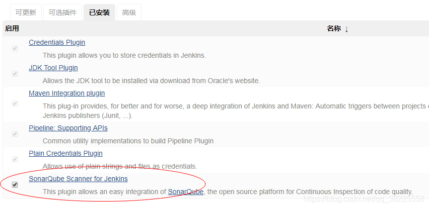
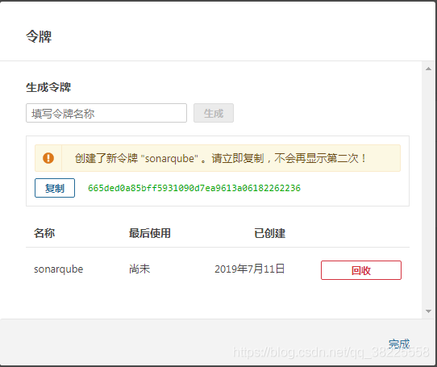
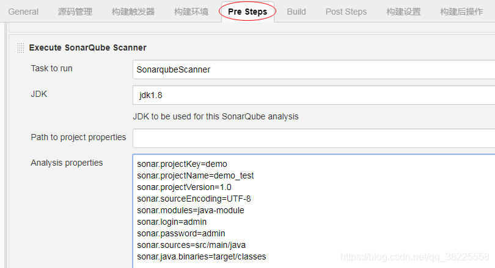
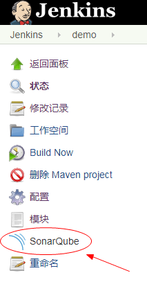

### 一、前言

http://localhost:8080/jenkins/pluginManager/available
之前步骤中没有安装SonarQube Scanner插件的话，记得安装


### 二、配置

#### （1）SonarQube Scanner for Jenkins插件配置

全局工具：http://localhost:8080/jenkins/configureTools/


#### （2）SonarQube配置

启动sonarqube

http://localhost:9000/admin/users

创建sonarqube令牌：665ded0a85bff5931090d7ea9613a06182262236


#### （3）回到Jenkins中 -> 系统配置 -> 添加SonarQube服务器配置

http://localhost:8080/jenkins/configure

> 温馨小提示：Server authentication token填入上一步我们生成的sonarqube令牌即可，小编这里暂时无法添加，原因未知，不知道是不是因为版本过高的原因，你们能填的就填上~


#### （4）项目配置

http://localhost:8080/jenkins/job/demo/configure
**Analysis properties** 如下：

```
sonar.projectKey=demo
sonar.projectName=demo_test
sonar.projectVersion=1.0 
sonar.sourceEncoding=UTF-8
sonar.modules=java-module
sonar.login=admin
sonar.password=admin　
#源码位置【例如我的在D:\Users\zhengqingya\.jenkins\workspace\demo\src\main\java，这里就填】
sonar.sources=src/main/java
#编译后class字节码位置
sonar.java.binaries=target/classes
```



### 三、构建完成 -> 选择SonarQube -> 右边点击OK可跳转到SonarQube界面中查看相应信息

> 小编这里因为Server authentication token处无法填入，暂时无法跳转...


