# JumpServer v2.20.2 部署使用

### 一、前言

JumpServer 是全球首款开源的堡垒机，使用 GNU GPL v3.0 开源协议，是符合 4A 规范的运维安全审计系统。

本文将基于`CentOS Linux release 7.6.1810 (Core)`对`JumpServer v2.20.2`进行部署使用。

[https://github.com/jumpserver/jumpserver](https://github.com/jumpserver/jumpserver)

### 二、部署

#### 1、在线一键部署

```shell
# 默认会安装到 /opt/jumpserver-installer-v2.20.2 目录
curl -sSL https://github.com/jumpserver/jumpserver/releases/download/v2.20.2/quick_start.sh | bash

# 安装完成后配置文件 /opt/jumpserver/config/config.txt

cd /opt/jumpserver-installer-v2.20.2

# 启动
./jmsctl.sh start
# 停止
./jmsctl.sh down
# 卸载
./jmsctl.sh uninstall
# 帮助
./jmsctl.sh -h
```

#### 2、离线部署

>
下载 [https://community.fit2cloud.com/#/products/jumpserver/downloads](https://community.fit2cloud.com/#/products/jumpserver/downloads)

```shell
cd /opt
tar zxvf jumpserver-offline-installer-v2.20.2-amd64-19.tar.gz
cd jumpserver-offline-installer-v2.20.2-amd64-19

# 根据需要修改配置文件模板, 如果不清楚用途可以跳过修改
cat config-example.txt

# 安装
./jmsctl.sh install

# 安装完成后配置文件 /opt/jumpserver/config/config.txt

# 启动
./jmsctl.sh start
# 停止
./jmsctl.sh down
# 卸载
./jmsctl.sh uninstall
# 帮助
./jmsctl.sh -h
```

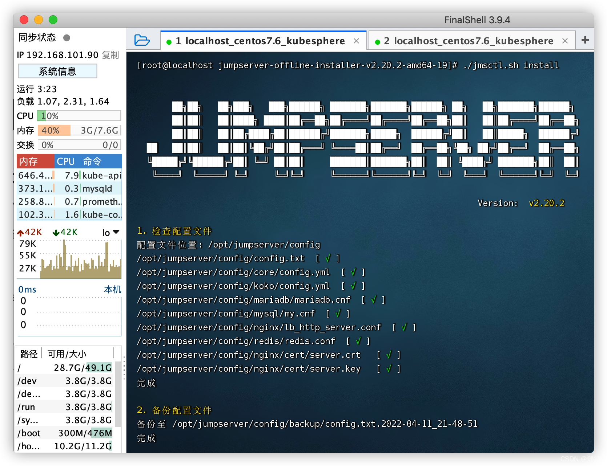
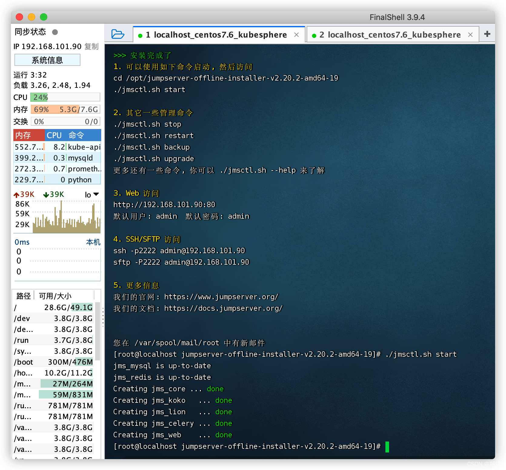

#### 3、docker-compose部署

> 参考 [https://github.com/jumpserver/Dockerfile](https://github.com/jumpserver/Dockerfile)

```shell
# 准备
git clone https://gitee.com/zhengqingya/docker-compose.git
cd docker-compose/Linux/jumpserver
cp config_example.conf .env
# 运行
docker-compose -f docker-compose-redis.yml -f docker-compose-mariadb.yml -f docker-compose.yml up
```

### 三、Web访问

访问地址: `ip:80`
默认账号密码:  `admin/admin`
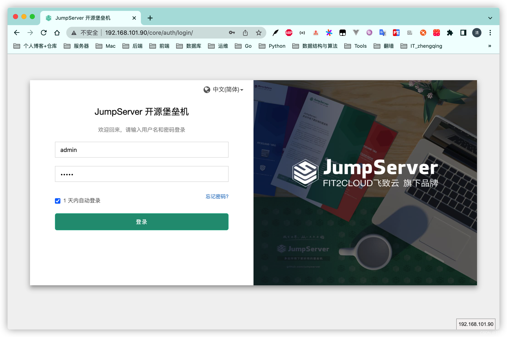


### 四、使用

#### 1、分配用户

##### a、用户管理 -- 创建角色

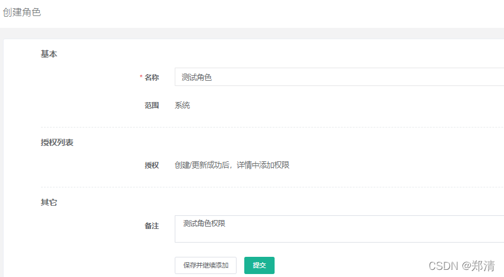
分配权限
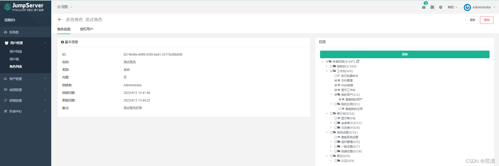

##### b、用户管理 -- 创建用户组

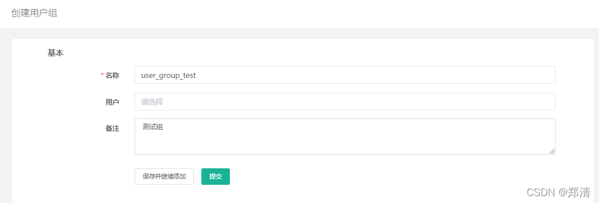

##### c、用户管理 -- 创建用户

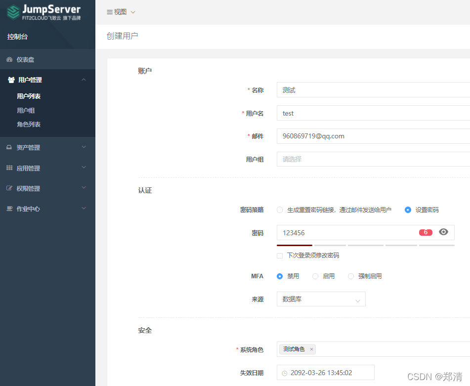

##### d、切换`test`账号登录查看访问权限

使用测试账号`test/123456`去登录访问看看
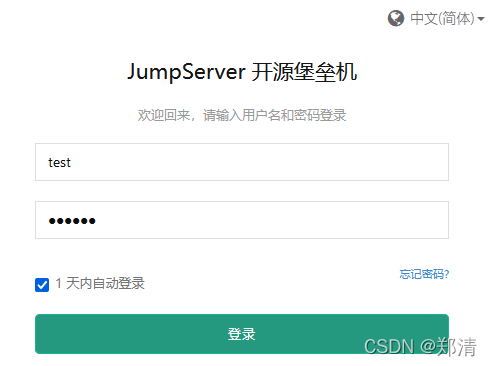


#### 2、创建资产

##### a、资产管理 -- 创建系统用户 -- 特权用户

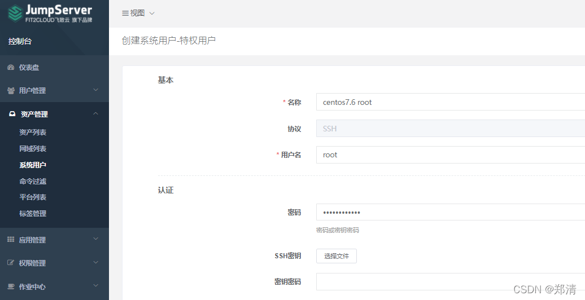

##### b、资产管理 -- 创建资产

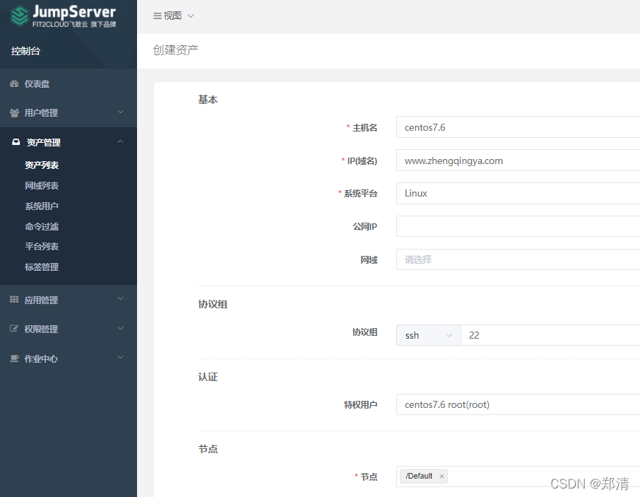
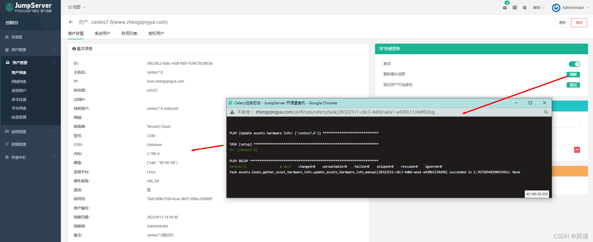


#### 3、给用户分配资产

##### a、权限管理 -- 创建资产授权规则

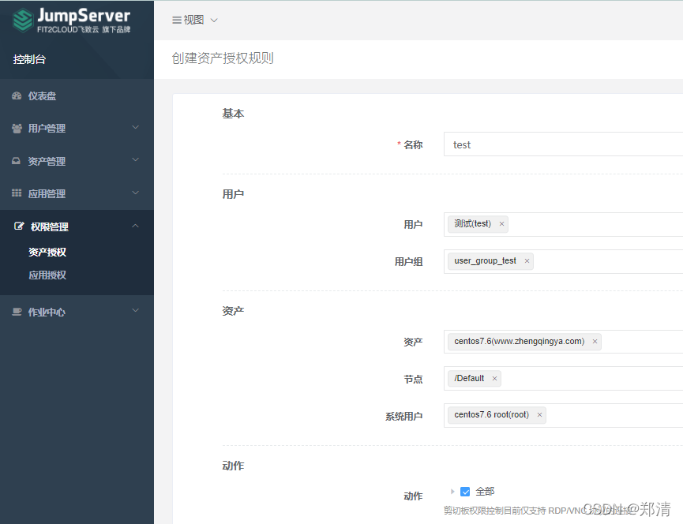


##### b、切换`test`账号登录查看资产


进入web终端


#### 4、创建应用

##### a、资产管理 -- 创建系统用户 -- 普通用户 -- MySQL

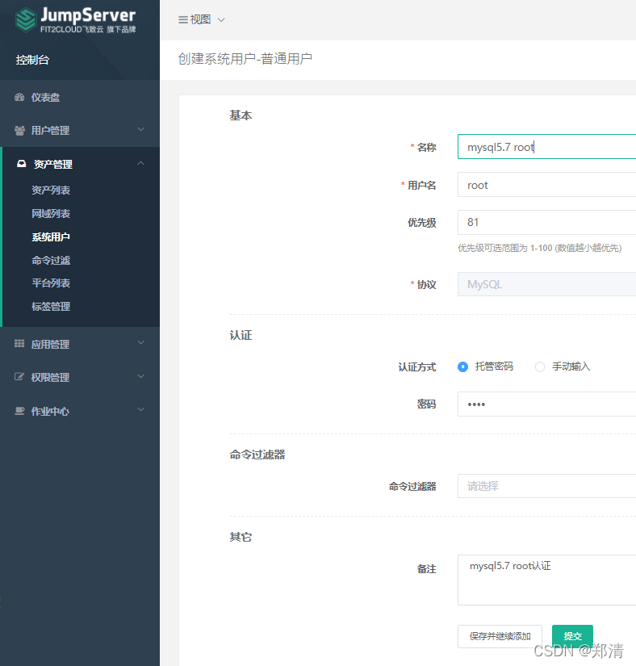

##### b、应用管理 -- 创建数据库应用


#### 5、给用户分配应用

##### a、权限管理 -- 创建应用授权规则

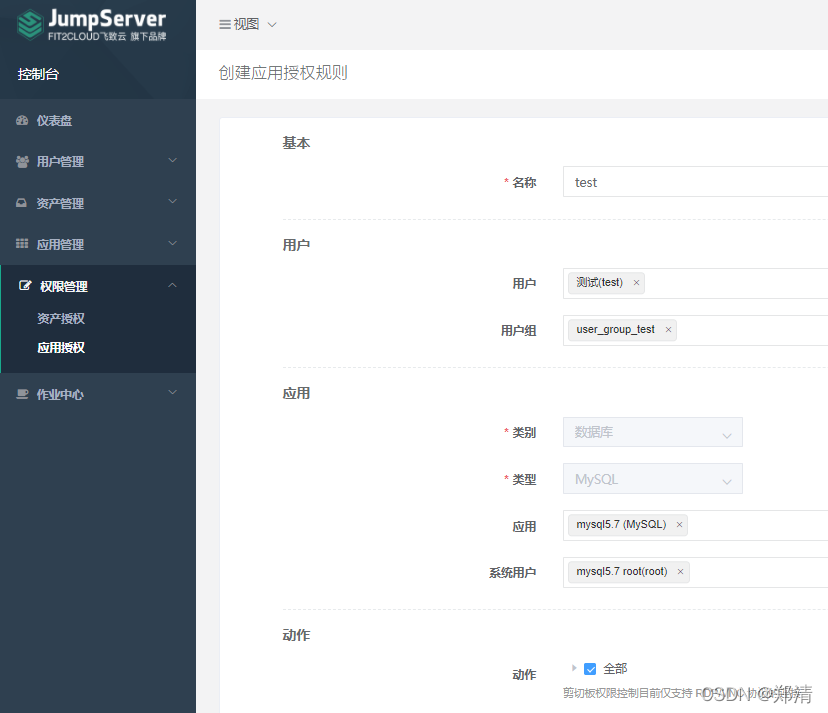

##### b、切换`test`账号登录查看应用

> tips: 记得给此账号分配应用权限 `^_^`


进入web终端


--- 

> 今日分享语句：
> 快乐要懂得分享，才能加倍的快乐。

