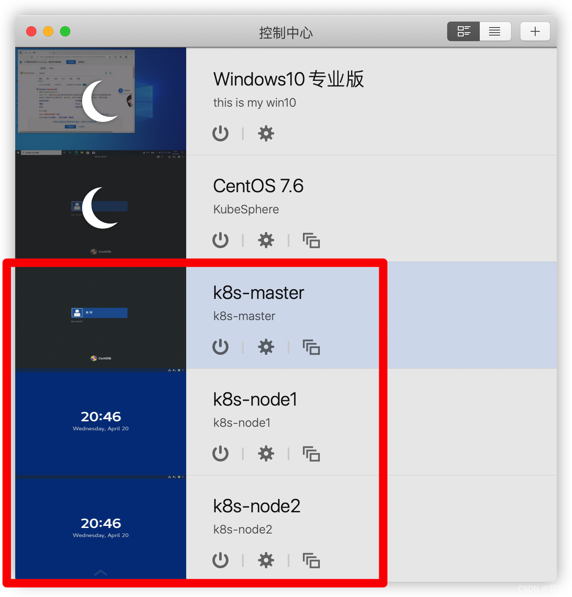
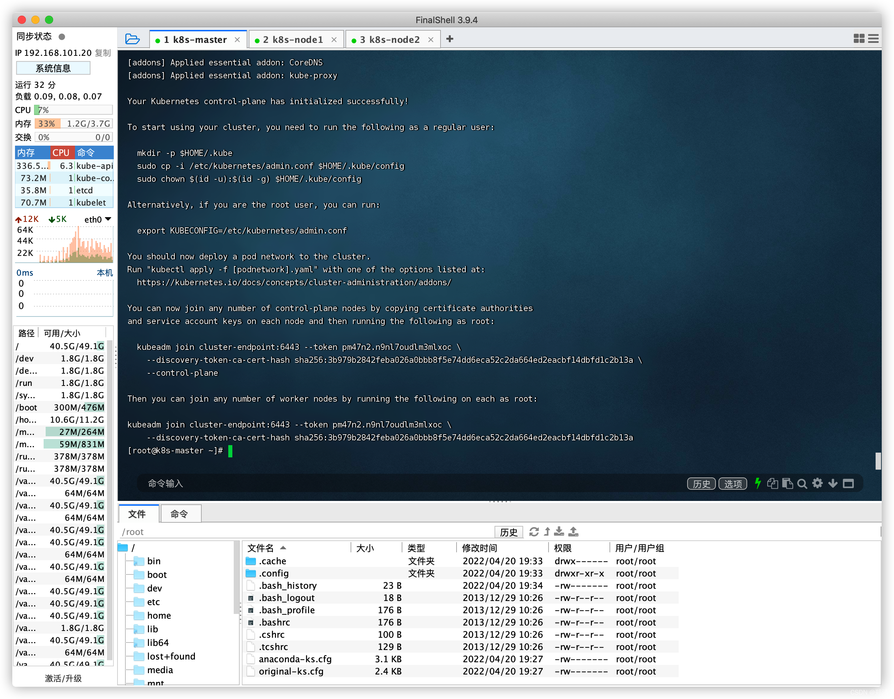
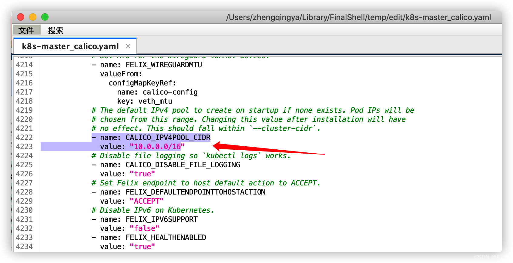
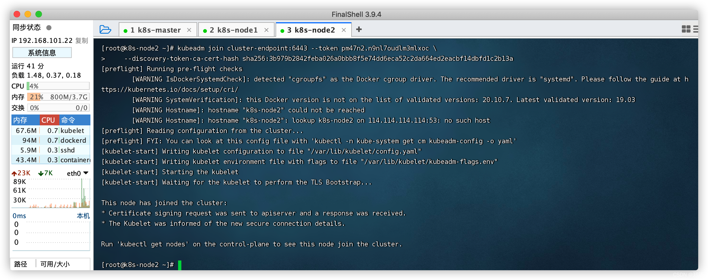
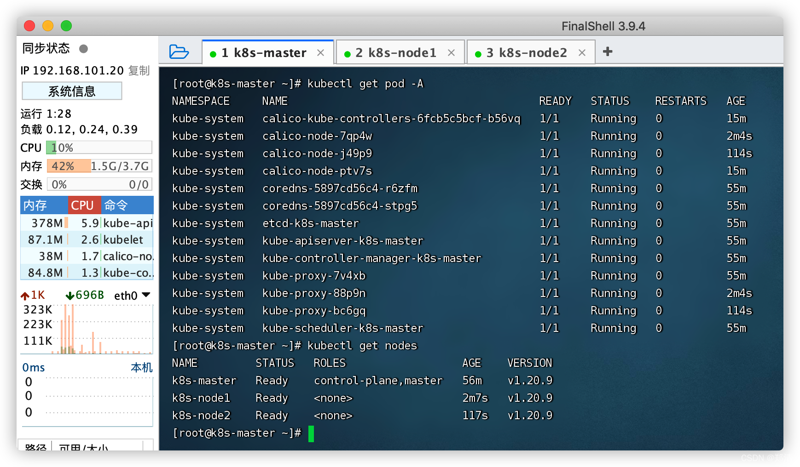
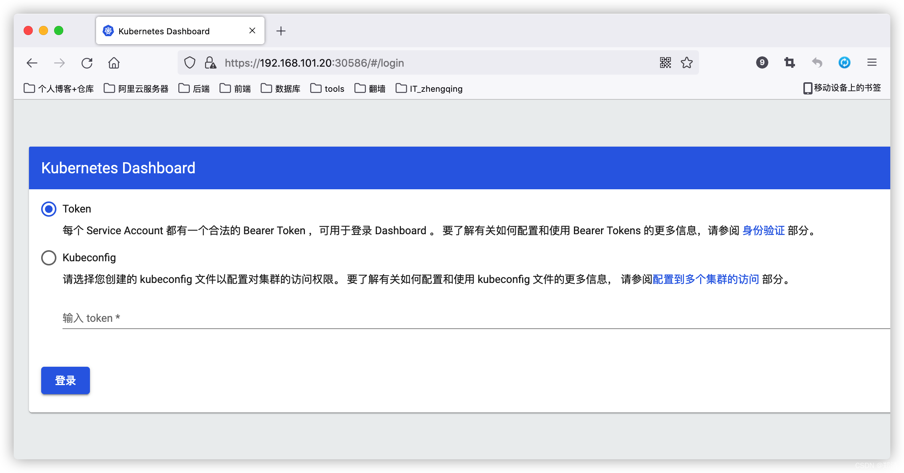
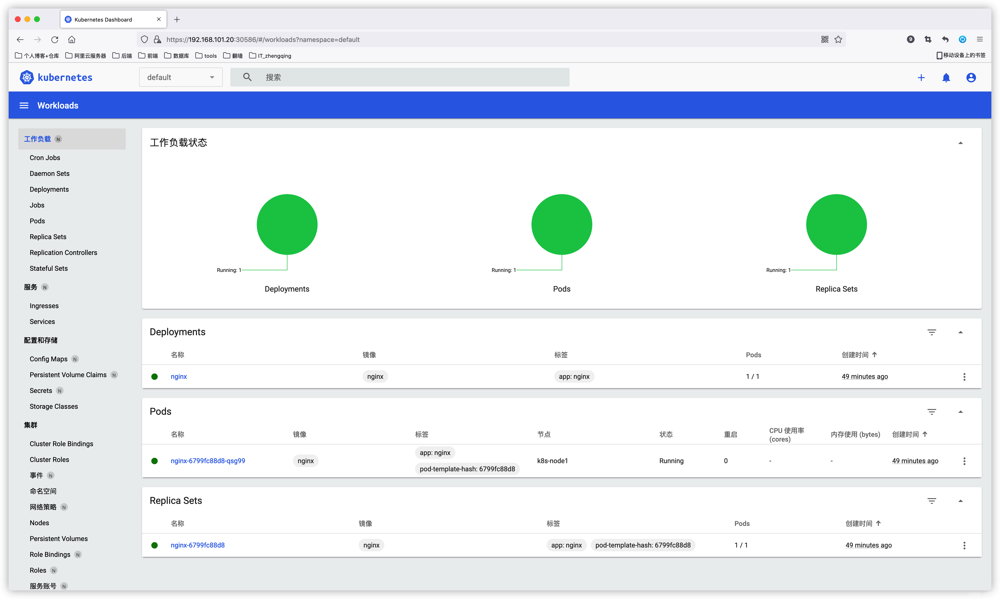

@[TOC](文章目录)

### 一、前言

本文将基于`CentOS Linux release 7.6.1810 (Core)`通过`Kubeadm`部署`Kubernetes集群`

[运维(29) CentOS7.6通过KubeOperator部署Kubernetes集群](https://zhengqing.blog.csdn.net/article/details/124060648)

> 可参考 [https://www.yuque.com/leifengyang/oncloud/ghnb83](https://www.yuque.com/leifengyang/oncloud/ghnb83)

### 二、环境准备

| 机器           | 说明       |
| -------------- | ---------- |
| 192.168.101.20 | k8s-master |
| 192.168.101.21 | k8s-node1  |
| 192.168.101.22 | k8s-node2  |



> tips: 除了特别说明的地方，所有机器都要做相同操作

#### 1、关闭防火墙

> tips: 此操作非必须，后续如果存在部分端口需要访问，记得开放即可。

```shell
# 关闭
systemctl stop firewalld
# 开机禁用
systemctl disable firewalld
# 查看状态
systemctl status firewalld 
```

#### 2、配置主机名

```shell
# 第1台机器
hostnamectl set-hostname k8s-master
# 第2台机器
hostnamectl set-hostname k8s-node1
# 第3台机器
hostnamectl set-hostname k8s-node2

# 查看
hostname
```

#### 3、禁用`SELinux`

```shell
setenforce 0
sed -i 's/^SELINUX=enforcing$/SELINUX=permissive/' /etc/selinux/config
```

#### 4、关闭`swap`

```shell
swapoff -a  
sed -ri 's/.*swap.*/#&/' /etc/fstab
```

#### 5、允许`iptables`检查桥接流量

```shell
cat <<EOF | sudo tee /etc/modules-load.d/k8s.conf
br_netfilter
EOF

cat <<EOF | sudo tee /etc/sysctl.d/k8s.conf
net.bridge.bridge-nf-call-ip6tables = 1
net.bridge.bridge-nf-call-iptables = 1
EOF

sysctl --system
```

#### 6、安装`Docker`

```shell
# 配置yum源
sudo yum install -y yum-utils
sudo yum-config-manager \
    --add-repo \
    http://mirrors.aliyun.com/docker-ce/linux/centos/docker-ce.repo


# 通过yum源安装docker
# sudo yum -y install docker
# 指定版本安装
sudo yum install -y docker-ce-20.10.7 docker-ce-cli-20.10.7 containerd.io-1.4.6

# 设置开机自启 & 现在启动
sudo systemctl enable --now docker

# 查看运行情况
sudo systemctl status docker

# 测试
docker run --rm alpine ping -c 5 baidu.com
```

### 三、安装`kubelet`&`kubeadm`&`kubectl`

```shell
cat <<EOF | sudo tee /etc/yum.repos.d/kubernetes.repo
[kubernetes]
name=Kubernetes
baseurl=http://mirrors.aliyun.com/kubernetes/yum/repos/kubernetes-el7-x86_64
enabled=1
gpgcheck=0
repo_gpgcheck=0
gpgkey=http://mirrors.aliyun.com/kubernetes/yum/doc/yum-key.gpg
   http://mirrors.aliyun.com/kubernetes/yum/doc/rpm-package-key.gpg
exclude=kubelet kubeadm kubectl
EOF

sudo yum install -y kubelet-1.20.9 kubeadm-1.20.9 kubectl-1.20.9 --disableexcludes=kubernetes

# 设置开机自启 & 现在启动
sudo systemctl enable --now kubelet

# 查看运行情况 -- tips: 目前每隔几秒就会重启，因为它陷入了一个等待 kubeadm 指令的死循环
sudo systemctl status kubelet
```

### 四、建立集群

#### 1、下载所需镜像

```shell
sudo tee ./images.sh <<-'EOF'
#!/bin/bash
images=(
kube-apiserver:v1.20.9
kube-proxy:v1.20.9
kube-controller-manager:v1.20.9
kube-scheduler:v1.20.9
coredns:1.7.0
etcd:3.4.13-0
pause:3.2
)
for imageName in ${images[@]} ; do
docker pull registry.cn-hangzhou.aliyuncs.com/lfy_k8s_images/$imageName
done
EOF
   
chmod +x ./images.sh && ./images.sh
```

#### 2、初始化主节点

```shell
# 查看master主机ip
ifconfig eth0
# 所有机器添加master域名映射
echo "192.168.101.20  cluster-endpoint" >> /etc/hosts

# 测试
ping cluster-endpoint

# [master机器执行] 初始化主节点  --apiserver-advertise-address使用master机器ip  另外注意下面3个地址网段和本地网段不能重复
kubeadm init \
--apiserver-advertise-address=192.168.101.20 \
--control-plane-endpoint=cluster-endpoint \
--image-repository registry.cn-hangzhou.aliyuncs.com/lfy_k8s_images \
--kubernetes-version v1.20.9 \
--service-cidr=10.96.0.0/16 \
--pod-network-cidr=10.0.0.0/16
```

日志信息如下：


```
Your Kubernetes control-plane has initialized successfully!

To start using your cluster, you need to run the following as a regular user:

  mkdir -p $HOME/.kube
  sudo cp -i /etc/kubernetes/admin.conf $HOME/.kube/config
  sudo chown $(id -u):$(id -g) $HOME/.kube/config

Alternatively, if you are the root user, you can run:

  export KUBECONFIG=/etc/kubernetes/admin.conf

You should now deploy a pod network to the cluster.
Run "kubectl apply -f [podnetwork].yaml" with one of the options listed at:
  https://kubernetes.io/docs/concepts/cluster-administration/addons/

You can now join any number of control-plane nodes by copying certificate authorities
and service account keys on each node and then running the following as root:

  kubeadm join cluster-endpoint:6443 --token pm47n2.n9nl7oudlm3mlxoc \
    --discovery-token-ca-cert-hash sha256:3b979b2842feba026a0bbb8f5e74dd6eca52c2da664ed2eacbf14dbfd1c2b13a \
    --control-plane 

Then you can join any number of worker nodes by running the following on each as root:

kubeadm join cluster-endpoint:6443 --token pm47n2.n9nl7oudlm3mlxoc \
    --discovery-token-ca-cert-hash sha256:3b979b2842feba026a0bbb8f5e74dd6eca52c2da664ed2eacbf14dbfd1c2b13a
```

根据上面日志输出提示操作即可

#### 3、配置`.kube/config`

> tips: master机器执行

```shell
mkdir -p $HOME/.kube
  sudo cp -i /etc/kubernetes/admin.conf $HOME/.kube/config
  sudo chown $(id -u):$(id -g) $HOME/.kube/config
```

#### 4、安装网络组件`Calico`

> tips: master机器执行

```shell
curl https://docs.projectcalico.org/manifests/calico.yaml -O

# 修改 `CALICO_IPV4POOL_CIDR` 为之前 `--pod-network-cidr` 值  (需要放开注释)
cat calico.yaml | grep 192.168.0.0
```



```shell
# 修改过后再次查看
cat calico.yaml | grep 10.0.0.0

# 根据配置文件，给集群创建资源
# kubectl apply -f xxx.yaml
kubectl apply -f calico.yaml
```

等待集群部署应用全部运行状态 `Running`

```shell
kubectl get pod -A
```


#### 5、加入node节点

> tips: node机器执行


```shell
kubeadm join cluster-endpoint:6443 --token pm47n2.n9nl7oudlm3mlxoc \
    --discovery-token-ca-cert-hash sha256:3b979b2842feba026a0bbb8f5e74dd6eca52c2da664ed2eacbf14dbfd1c2b13a
```



```shell
# 如果忘记也可在master机器执行如下命令生成新令牌，然后拿到命令去node机器执行加入
# kubeadm token create --print-join-command
```

#### 6、等待集群完成

```shell
# 查看集群所有节点
kubectl get nodes

# 查看集群部署应用
kubectl get pods -A
```



### 五、测试集群 -- 创建nginx容器

> tips: 在master机器执行

```shell
# 创建nginx容器
kubectl create deployment nginx --image=nginx

# 对外暴露80端口
kubectl expose deployment nginx --port=80 --target-port=80 --type=NodePort

# 查看服务
kubectl get service nginx
```


访问： `http://集群任意IP:32474`


### 六、部署`Kubernetes Dashboard` -- 可视化界面

> [https://github.com/kubernetes/dashboard](https://github.com/kubernetes/dashboard)
> tips: 在master机器执行

#### 1、部署

```shell
# 部署
curl https://raw.githubusercontent.com/kubernetes/dashboard/v2.5.1/aio/deploy/recommended.yaml -O
kubectl apply -f recommended.yaml

# 设置访问端口  `type: ClusterIP` 修改为 `type: NodePort`
kubectl edit svc kubernetes-dashboard -n kubernetes-dashboard

# 查看服务端口
kubectl get svc -A |grep kubernetes-dashboard
```


访问： `https://集群任意IP:30586`

> tips: 小编使用虚拟机环境部署，通过谷歌浏览器无法正常访问，然后换了个火狐浏览器正常访问 `^_^`



#### 2、创建访问账号

```shell
echo 'apiVersion: v1
kind: ServiceAccount
metadata:
  name: admin-user
  namespace: kubernetes-dashboard
---
apiVersion: rbac.authorization.k8s.io/v1
kind: ClusterRoleBinding
metadata:
  name: admin-user
roleRef:
  apiGroup: rbac.authorization.k8s.io
  kind: ClusterRole
  name: cluster-admin
subjects:
- kind: ServiceAccount
  name: admin-user
  namespace: kubernetes-dashboard' > kubernetes-dashboard-user.yaml
  
kubectl apply -f kubernetes-dashboard-user.yaml
```

#### 3、获取访问令牌

````shell
kubectl -n kubernetes-dashboard get secret $(kubectl -n kubernetes-dashboard get sa/admin-user -o jsonpath="{.secrets[0].name}") -o go-template="{{.data.token | base64decode}}"
````


#### 4、访问




--- 

> 今日分享语句：
> 真正有光的人，是压的时间越久，深度越深，绽放的光芒才可以越灿烂。
