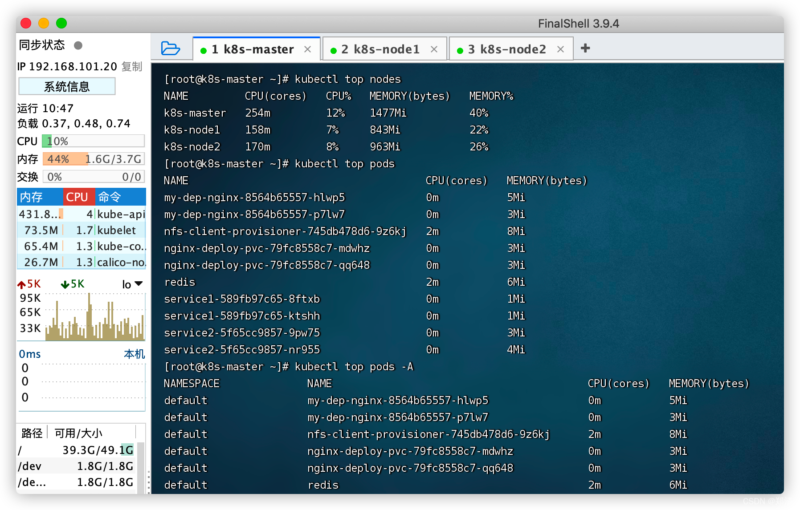

@[TOC](文章目录)

### 一、前言

1. [运维(33) CentOS7.6通过Kubeadm部署Kubernetes集群](https://zhengqing.blog.csdn.net/article/details/124306694)
2. [运维(34) K8s使用](https://zhengqing.blog.csdn.net/article/details/124329119)

本文将基于`CentOS Linux release 7.6.1810 (Core)`通过`Kubernetes`最小化安装`KubeSphere`

> 可参考 [https://kubesphere.io/zh/docs/quick-start/minimal-kubesphere-on-k8s](https://kubesphere.io/zh/docs/quick-start/minimal-kubesphere-on-k8s)

### 二、环境准备

| 机器           | 说明       |
| -------------- | ---------- |
| 192.168.101.20 | k8s-master |
| 192.168.101.21 | k8s-node1  |
| 192.168.101.22 | k8s-node2  |


#### 1、配置k8s集群中的默认存储类型 -- NFS

##### a、所有节点

```shell
# 所有机器安装
yum install -y nfs-utils
```

##### b、主节点

```shell
# nfs主节点
echo "/nfs/data/ *(insecure,rw,sync,no_root_squash)" > /etc/exports
mkdir -p /nfs/data

# 设置开机自启 & 现在启动  -- 远程绑定服务
systemctl enable rpcbind --now

# nfs服务
systemctl enable nfs-server --now

# 配置生效
exportfs -r

# 查看
exportfs
```

##### c、从节点

```shell
# 查看远程机器有哪些目录可以同步 -- 使用master机器ip地址
showmount -e 192.168.101.20

# 执行以下命令挂载 nfs 服务器上的共享目录到本机路径
mkdir -p /nfs/data

# 同步远程机器数据
mount -t nfs 192.168.101.20:/nfs/data /nfs/data
```

测试

```shell
# 在任意机器写入一个测试文件
echo "hello nfs" > /nfs/data/test.txt

# 在其它机器查看数据
cat /nfs/data/test.txt
```

##### d、配置动态供应的默认存储类

```shell
cat <<EOF | sudo tee ./storageclass.yaml

## 创建了一个存储类
apiVersion: storage.k8s.io/v1
kind: StorageClass
metadata:
  name: nfs-storage
  annotations:
    storageclass.kubernetes.io/is-default-class: "true"
provisioner: k8s-sigs.io/nfs-subdir-external-provisioner
parameters:
  archiveOnDelete: "true"  ## 删除pv的时候，pv的内容是否要备份

---
apiVersion: apps/v1
kind: Deployment
metadata:
  name: nfs-client-provisioner
  labels:
    app: nfs-client-provisioner
  # replace with namespace where provisioner is deployed
  namespace: default
spec:
  replicas: 1
  strategy:
    type: Recreate
  selector:
    matchLabels:
      app: nfs-client-provisioner
  template:
    metadata:
      labels:
        app: nfs-client-provisioner
    spec:
      serviceAccountName: nfs-client-provisioner
      containers:
        - name: nfs-client-provisioner
          image: registry.cn-hangzhou.aliyuncs.com/lfy_k8s_images/nfs-subdir-external-provisioner:v4.0.2
          # resources:
          #    limits:
          #      cpu: 10m
          #    requests:
          #      cpu: 10m
          volumeMounts:
            - name: nfs-client-root
              mountPath: /persistentvolumes
          env:
            - name: PROVISIONER_NAME
              value: k8s-sigs.io/nfs-subdir-external-provisioner
            - name: NFS_SERVER
              value: 192.168.101.20 ## 指定自己nfs服务器地址
            - name: NFS_PATH  
              value: /nfs/data  ## nfs服务器共享的目录
      volumes:
        - name: nfs-client-root
          nfs:
            server: 192.168.101.20
            path: /nfs/data
---
apiVersion: v1
kind: ServiceAccount
metadata:
  name: nfs-client-provisioner
  # replace with namespace where provisioner is deployed
  namespace: default
---
kind: ClusterRole
apiVersion: rbac.authorization.k8s.io/v1
metadata:
  name: nfs-client-provisioner-runner
rules:
  - apiGroups: [""]
    resources: ["nodes"]
    verbs: ["get", "list", "watch"]
  - apiGroups: [""]
    resources: ["persistentvolumes"]
    verbs: ["get", "list", "watch", "create", "delete"]
  - apiGroups: [""]
    resources: ["persistentvolumeclaims"]
    verbs: ["get", "list", "watch", "update"]
  - apiGroups: ["storage.k8s.io"]
    resources: ["storageclasses"]
    verbs: ["get", "list", "watch"]
  - apiGroups: [""]
    resources: ["events"]
    verbs: ["create", "update", "patch"]
---
kind: ClusterRoleBinding
apiVersion: rbac.authorization.k8s.io/v1
metadata:
  name: run-nfs-client-provisioner
subjects:
  - kind: ServiceAccount
    name: nfs-client-provisioner
    # replace with namespace where provisioner is deployed
    namespace: default
roleRef:
  kind: ClusterRole
  name: nfs-client-provisioner-runner
  apiGroup: rbac.authorization.k8s.io
---
kind: Role
apiVersion: rbac.authorization.k8s.io/v1
metadata:
  name: leader-locking-nfs-client-provisioner
  # replace with namespace where provisioner is deployed
  namespace: default
rules:
  - apiGroups: [""]
    resources: ["endpoints"]
    verbs: ["get", "list", "watch", "create", "update", "patch"]
---
kind: RoleBinding
apiVersion: rbac.authorization.k8s.io/v1
metadata:
  name: leader-locking-nfs-client-provisioner
  # replace with namespace where provisioner is deployed
  namespace: default
subjects:
  - kind: ServiceAccount
    name: nfs-client-provisioner
    # replace with namespace where provisioner is deployed
    namespace: default
roleRef:
  kind: Role
  name: leader-locking-nfs-client-provisioner
  apiGroup: rbac.authorization.k8s.io
  
EOF

# 创建
kubectl apply -f storageclass.yaml
# 删除
# kubectl delete -f storageclass.yaml

# 查看存储类
kubectl get sc
```


创建一个PVC测试一下动态供应能力

```shell
cat <<EOF | sudo tee ./pvc.yaml

kind: PersistentVolumeClaim
apiVersion: v1
metadata:
  name: test-pvc
spec:
  accessModes:
    - ReadWriteMany
  resources:
    requests:
      storage: 200Mi

EOF


# 应用
kubectl apply -f pvc.yaml

# 查看
kubectl get pvc
kubectl get pv
```


#### 2、metrics-server

> 集群指标监控组件。

```shell
cat <<EOF | sudo tee ./metrics-server.yaml

apiVersion: v1
kind: ServiceAccount
metadata:
  labels:
    k8s-app: metrics-server
  name: metrics-server
  namespace: kube-system
---
apiVersion: rbac.authorization.k8s.io/v1
kind: ClusterRole
metadata:
  labels:
    k8s-app: metrics-server
    rbac.authorization.k8s.io/aggregate-to-admin: "true"
    rbac.authorization.k8s.io/aggregate-to-edit: "true"
    rbac.authorization.k8s.io/aggregate-to-view: "true"
  name: system:aggregated-metrics-reader
rules:
- apiGroups:
  - metrics.k8s.io
  resources:
  - pods
  - nodes
  verbs:
  - get
  - list
  - watch
---
apiVersion: rbac.authorization.k8s.io/v1
kind: ClusterRole
metadata:
  labels:
    k8s-app: metrics-server
  name: system:metrics-server
rules:
- apiGroups:
  - ""
  resources:
  - pods
  - nodes
  - nodes/stats
  - namespaces
  - configmaps
  verbs:
  - get
  - list
  - watch
---
apiVersion: rbac.authorization.k8s.io/v1
kind: RoleBinding
metadata:
  labels:
    k8s-app: metrics-server
  name: metrics-server-auth-reader
  namespace: kube-system
roleRef:
  apiGroup: rbac.authorization.k8s.io
  kind: Role
  name: extension-apiserver-authentication-reader
subjects:
- kind: ServiceAccount
  name: metrics-server
  namespace: kube-system
---
apiVersion: rbac.authorization.k8s.io/v1
kind: ClusterRoleBinding
metadata:
  labels:
    k8s-app: metrics-server
  name: metrics-server:system:auth-delegator
roleRef:
  apiGroup: rbac.authorization.k8s.io
  kind: ClusterRole
  name: system:auth-delegator
subjects:
- kind: ServiceAccount
  name: metrics-server
  namespace: kube-system
---
apiVersion: rbac.authorization.k8s.io/v1
kind: ClusterRoleBinding
metadata:
  labels:
    k8s-app: metrics-server
  name: system:metrics-server
roleRef:
  apiGroup: rbac.authorization.k8s.io
  kind: ClusterRole
  name: system:metrics-server
subjects:
- kind: ServiceAccount
  name: metrics-server
  namespace: kube-system
---
apiVersion: v1
kind: Service
metadata:
  labels:
    k8s-app: metrics-server
  name: metrics-server
  namespace: kube-system
spec:
  ports:
  - name: https
    port: 443
    protocol: TCP
    targetPort: https
  selector:
    k8s-app: metrics-server
---
apiVersion: apps/v1
kind: Deployment
metadata:
  labels:
    k8s-app: metrics-server
  name: metrics-server
  namespace: kube-system
spec:
  selector:
    matchLabels:
      k8s-app: metrics-server
  strategy:
    rollingUpdate:
      maxUnavailable: 0
  template:
    metadata:
      labels:
        k8s-app: metrics-server
    spec:
      containers:
      - args:
        - --cert-dir=/tmp
        - --kubelet-insecure-tls
        - --secure-port=4443
        - --kubelet-preferred-address-types=InternalIP,ExternalIP,Hostname
        - --kubelet-use-node-status-port
        image: registry.cn-hangzhou.aliyuncs.com/lfy_k8s_images/metrics-server:v0.4.3
        imagePullPolicy: IfNotPresent
        livenessProbe:
          failureThreshold: 3
          httpGet:
            path: /livez
            port: https
            scheme: HTTPS
          periodSeconds: 10
        name: metrics-server
        ports:
        - containerPort: 4443
          name: https
          protocol: TCP
        readinessProbe:
          failureThreshold: 3
          httpGet:
            path: /readyz
            port: https
            scheme: HTTPS
          periodSeconds: 10
        securityContext:
          readOnlyRootFilesystem: true
          runAsNonRoot: true
          runAsUser: 1000
        volumeMounts:
        - mountPath: /tmp
          name: tmp-dir
      nodeSelector:
        kubernetes.io/os: linux
      priorityClassName: system-cluster-critical
      serviceAccountName: metrics-server
      volumes:
      - emptyDir: {}
        name: tmp-dir
---
apiVersion: apiregistration.k8s.io/v1
kind: APIService
metadata:
  labels:
    k8s-app: metrics-server
  name: v1beta1.metrics.k8s.io
spec:
  group: metrics.k8s.io
  groupPriorityMinimum: 100
  insecureSkipTLSVerify: true
  service:
    name: metrics-server
    namespace: kube-system
  version: v1beta1
  versionPriority: 100
  
EOF

# 创建
kubectl apply -f metrics-server.yaml
# 删除
# kubectl delete -f metrics-server.yaml

# 查看数据
kubectl top nodes
kubectl top pods
kubectl top pods -A
```



### 三、安装KubeSphere

```shell
# 安装
wget https://github.com/kubesphere/ks-installer/releases/download/v3.2.1/kubesphere-installer.yaml
kubectl apply -f kubesphere-installer.yaml

wget https://github.com/kubesphere/ks-installer/releases/download/v3.2.1/cluster-configuration.yaml
kubectl apply -f cluster-configuration.yaml
```

```shell
# 检查安装日志
kubectl logs -n kubesphere-system $(kubectl get pod -n kubesphere-system -l app=ks-install -o jsonpath='{.items[0].metadata.name}') -f

# 查看所有 Pod 是否在 KubeSphere 的相关命名空间中正常运行
kubectl get pod --all-namespaces

# 检查控制台的端口
kubectl get svc/ks-console -n kubesphere-system
```


访问`集群任意机器IP:30880`
初始账号密码: `admin/P@88w0rd`


### 四、卸载KubeSphere

```shell
wget https://raw.githubusercontent.com/kubesphere/ks-installer/release-3.1/scripts/kubesphere-delete.sh && sh kubesphere-delete.sh
```

---

> 今日分享语句：
> 为了未来好一点,现在苦一点有什么。
