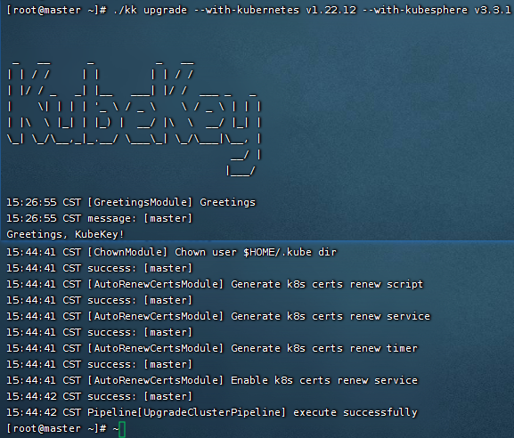
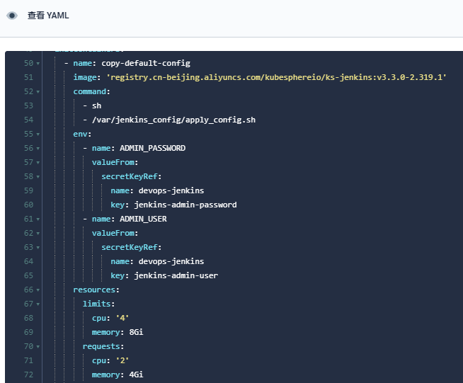

@[TOC](文章目录)

### 一、前言

KubeSphere 是在 Kubernetes 之上构建的以应用为中心的多租户容器平台，提供全栈的 IT 自动化运维的能力，简化企业的 DevOps 工作流。
KubeSphere 提供了运维友好的向导式操作界面，帮助企业快速构建一个强大和功能丰富的容器云平台。

本文将基于`CentOS Linux release 7.6.1810 (Core)`以 `All-in-One` 模式安装`KubeSphere`

>
可参考 [https://kubesphere.io/zh/docs/quick-start/all-in-one-on-linux](https://kubesphere.io/zh/docs/quick-start/all-in-one-on-linux)

### 二、环境准备

> tips: 这一步可以不操作，后面`kubekey`会自动安装最新版本的docker；
> 如果想指定docker版本的话，这里就可以提前安装docker

```shell
# 配置yum源
sudo yum install -y yum-utils
sudo yum-config-manager \
    --add-repo \
    http://mirrors.aliyun.com/docker-ce/linux/centos/docker-ce.repo
    
# 安装Docker -- 指定版本安装
sudo yum install -y docker-ce-20.10.7 docker-ce-cli-20.10.7 containerd.io-1.4.6
# 设置开机自启 & 现在启动
sudo systemctl enable --now docker
# 查看运行情况
sudo systemctl status docker
```

### 三、以 `All-in-One` 模式安装 `KubeSphere`

```shell
# 配置主机名
hostnamectl set-hostname master

# 准备
mkdir -p /home/soft/kubesphere
cd /home/soft/kubesphere

# 安装相关依赖项
yum -y install socat conntrack conntrack-tools ebtables ipset ipvsadm

# 下载 KubeKey
export KKZONE=cn
curl -sfL https://get-kk.kubesphere.io | VERSION=v2.0.0 sh -
chmod +x kk

# 开始安装
# ./kk create cluster [--with-kubernetes version] [--with-kubesphere version]
./kk create cluster --with-kubernetes v1.21.5 --with-kubesphere v3.2.1
```


日志如下的时候：表示Kubernetes部署完成，等待部署KubeSphere，这里时间会有点久~

`Please wait for the installation to complete:   >>---> `

如下安装成功

> tips: 记录下控制台地址，账号密码
> Console: http://192.168.101.89:30880
> Account: admin
> Password: P@88w0rd


```shell
# 查看版本
kubectl version --short=true

# 验证安装结果
kubectl logs -n kubesphere-system $(kubectl get pod -n kubesphere-system -l app=ks-install -o jsonpath='{.items[0].metadata.name}') -f

# 检查 KubeSphere 相关组件的运行状况
kubectl get pod --all-namespaces
```

### 四、访问控制台


### 五、卸载

>
可参考 [https://kubesphere.io/zh/docs/installing-on-linux/uninstall-kubesphere-and-kubernetes](https://kubesphere.io/zh/docs/installing-on-linux/uninstall-kubesphere-and-kubernetes)

```shell
./kk delete cluster
```


### 六、使用 KubeKey 升级 （`kubesphere v3.2.1` -> `kubesphere v3.3.1`）

> tips: 您需要有一个运行 KubeSphere v3.2.x 的集群。
> 如果您的 KubeSphere 是 v3.1.0 或更早的版本，请先升级至 v3.2.x。

```shell
# 下载 KubeKey
export KKZONE=cn
curl -sfL https://get-kk.kubesphere.io | VERSION=v2.3.0 sh -
# 为 kk 添加可执行权限
chmod +x kk
# All-in-One 集群: 运行以下命令使用 KubeKey 将您的单节点集群升级至 KubeSphere 3.3 和 Kubernetes v1.22.12：
./kk upgrade --with-kubernetes v1.22.12 --with-kubesphere v3.3.1
```




> tips: 经测试升级后devops不能正常使用`一直在等待中`...
> 
> 通过卸载devops后重新启用也不可用...
> 个人感觉为了避免后期再有其它功能异常，这里直接重装新版kubesphere吧... 当然我这里里面目前也没啥东西，所以不重要...

---

> 补充说明：
> 重装也没用... 可能是我等太久太着急了 后面发现还有一个在Pending...
> `kubectl get pod -n kubesphere-devops-system`
> 

下面来尝试下解决

```shell
# 查看原因
kubectl describe pod devops-jenkins-6f665b6758-6fztr -n kubesphere-devops-system

# QoS Class:                   Burstable
# Node-Selectors:              <none>
# Tolerations:                 node.kubernetes.io/not-ready:NoExecute op=Exists for 300s
#                              node.kubernetes.io/unreachable:NoExecute op=Exists for 300s
# Events:
#   Type     Reason            Age                 From               Message
#   ----     ------            ----                ----               -------
#   Warning  FailedScheduling  38s (x13 over 12m)  default-scheduler  0/1 nodes are available: 1 Insufficient cpu.

# 查看节点信息
kubectl get nodes
kubectl describe node master
```

算了... 搞不懂，暂时放弃，恢复旧版本`kubesphere v3.2.1` ^_^

会不会是因为新版本jenkins运行内存太大申请不了足够内存导致？？ 目前测试机条件有限，到处为止吧...



--- 

> 今日分享语句：
> 永远成功的秘密,就是每天淘汰自己。
