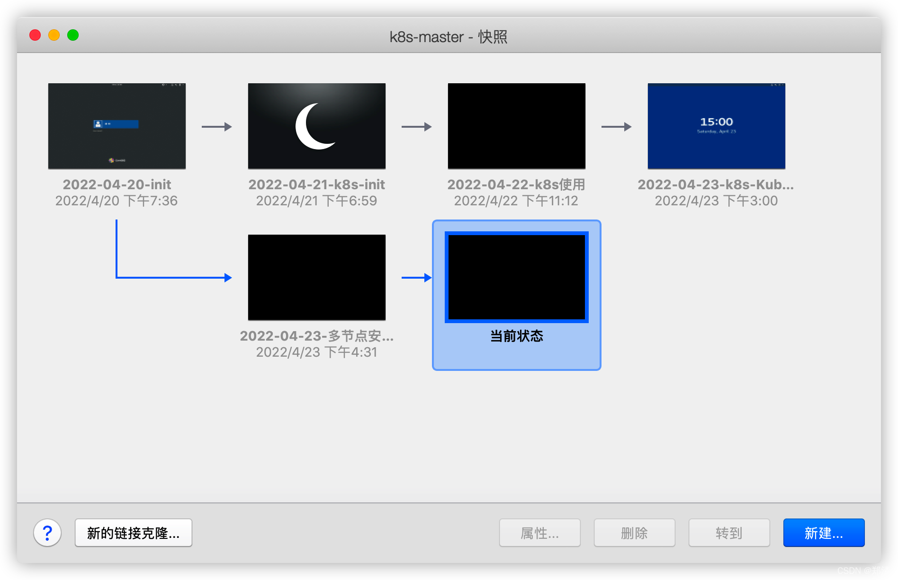
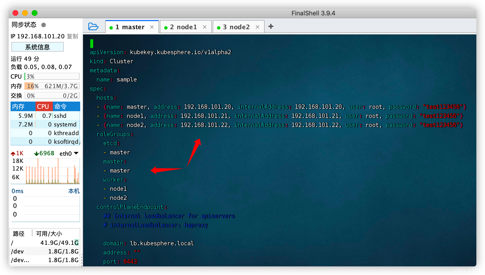
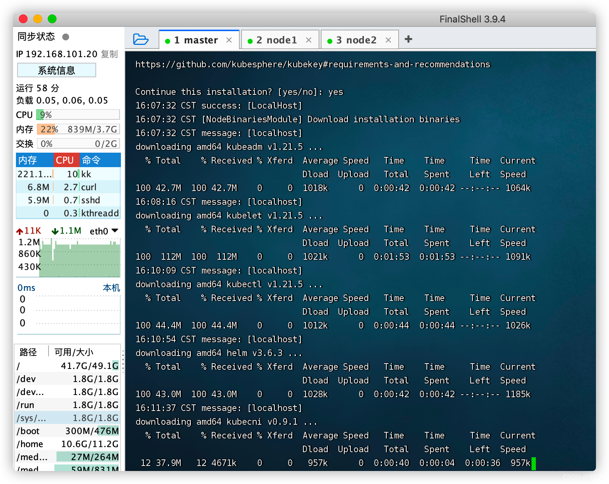
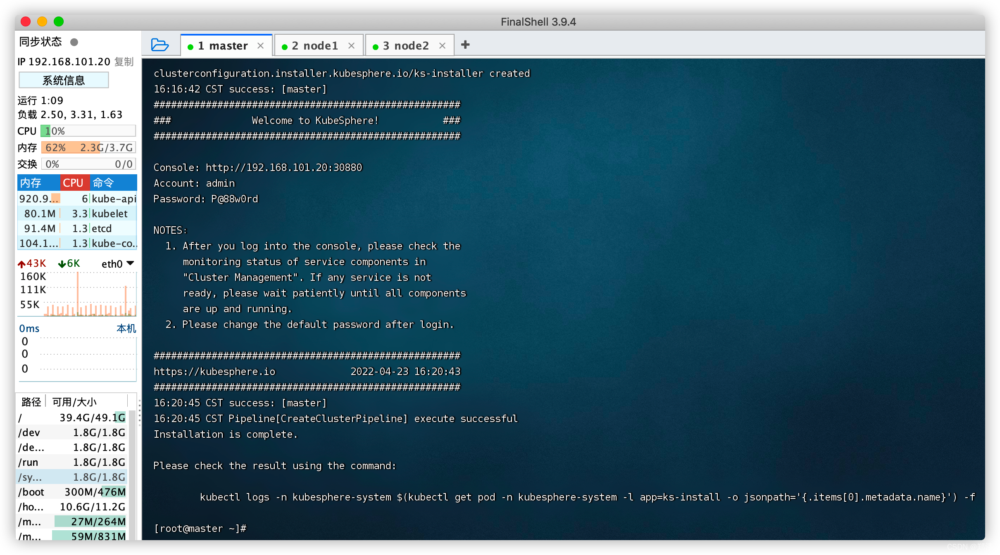
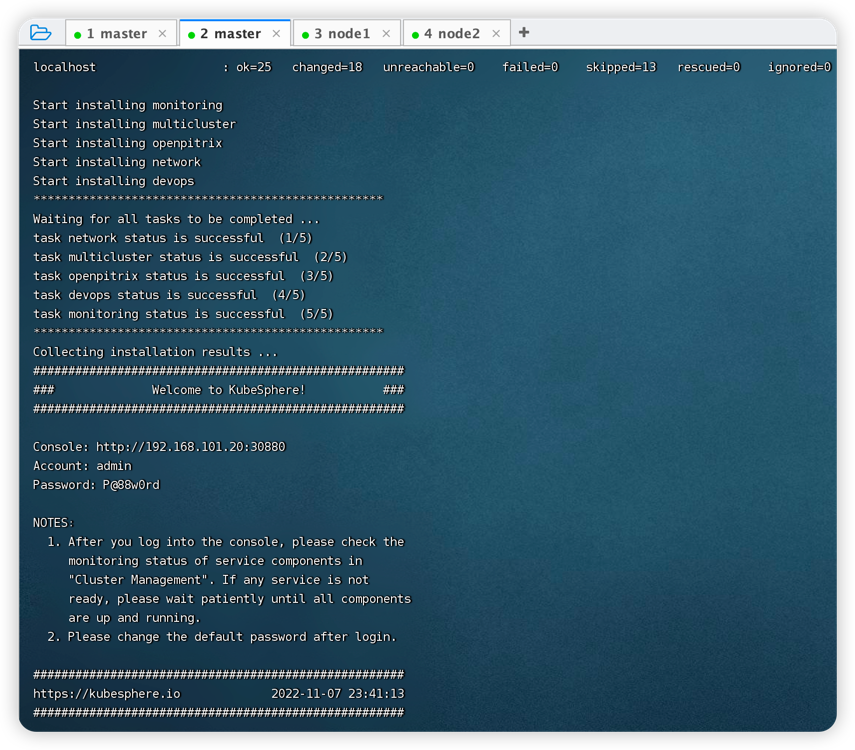

@[TOC](文章目录)

### 一、前言

1. [运维(27) CentOS7.6通过KubeKey安装KubeSphere (All-in-One模式)](https://zhengqing.blog.csdn.net/article/details/124008157)
2. [运维(35) CentOS7.6通过Kubernetes安装KubeSphere](https://zhengqing.blog.csdn.net/article/details/124065268)

本文将基于`CentOS Linux release 7.6.1810 (Core)` 多节点安装 `KubeSphere`


> 可参考 [https://kubesphere.io/zh/docs/installing-on-linux/introduction/multioverview](https://kubesphere.io/zh/docs/installing-on-linux/introduction/multioverview)

### 二、环境准备

| 机器           | 说明   | 角色         |
| -------------- | ------ | ------------ |
| 192.168.101.20 | master | master, etcd |
| 192.168.101.21 | node1  | worker       |
| 192.168.101.22 | node2  | worker       |

> 这里小编先将之前环境保存下快照，然后用一个干净的环境来进行操作。
> 

#### 1、配置主机名

```shell
# 第1台机器
hostnamectl set-hostname master
# 第2台机器
hostnamectl set-hostname node1
# 第3台机器
hostnamectl set-hostname node2

# 查看
hostname
```

#### 2、安装相关依赖项

> 所有机器执行

```shell
yum -y install socat conntrack ebtables ipset
```

### 三、安装KubeSphere

> master机器执行

#### 1、下载KubeKey

```shell
export KKZONE=cn
curl -sfL https://get-kk.kubesphere.io | VERSION=v2.0.0 sh -
chmod +x kk
```

#### 2、创建集群配置文件

> 会创建默认文件 `config-sample.yaml`

```shell
# ./kk create config [--with-kubernetes version] [--with-kubesphere version] [(-f | --file) path]
./kk create config --with-kubernetes v1.21.5 --with-kubesphere v3.2.1
```

编辑配置文件

```shell
vim config-sample.yaml
```



```yml
spec:
  hosts:
    - { name: master, address: 192.168.101.20, internalAddress: 192.168.101.20, user: root, password: "test123456" }
    - { name: node1, address: 192.168.101.21, internalAddress: 192.168.101.21, user: root, password: "test123456" }
    - { name: node2, address: 192.168.101.22, internalAddress: 192.168.101.22, user: root, password: "test123456" }
  roleGroups:
    etcd:
      - master
    master:
      - master
    worker:
      - node1
      - node2
  controlPlaneEndpoint:
    domain: lb.kubesphere.local
    address: ""
    port: 6443
```

> tips: 可查看[config-sample.yaml](config-sample.yaml)配置文件开启部分功能
> 修改的地方用`# TODO`开头标注
> 机器内存小的别全部开启！！！

#### 3、使用配置文件创建集群

```shell
./kk create cluster -f config-sample.yaml
```


然后等它自己慢慢安装吧...

10分钟左右安装完成`^_^`


#### 4、验证安装

```shell
kubectl logs -n kubesphere-system $(kubectl get pod -n kubesphere-system -l app=ks-install -o jsonpath='{.items[0].metadata.name}') -f
```



#### 5、访问

访问`集群任意机器IP:30880`
初始账号密码: `admin/P@88w0rd`


### 四、卸载KubeSphere和Kubernetes

```shell
./kk delete cluster -f config-sample.yaml
```


--- 

> 今日分享语句：
> 人生的意义不在于留下什么，只要你经历过，就是最大的美好，这不是无能，而是一种超然。
